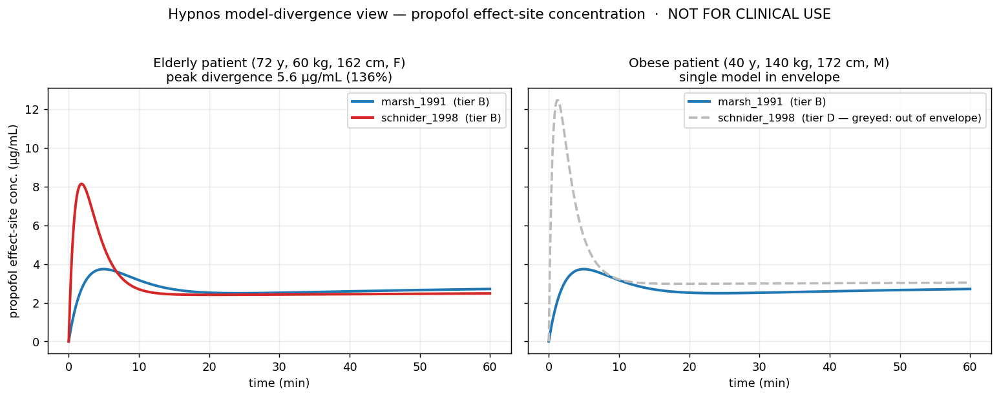
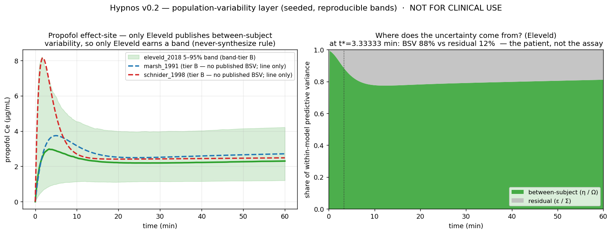
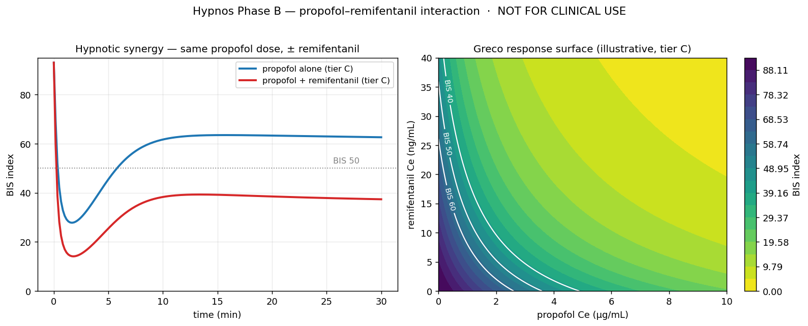
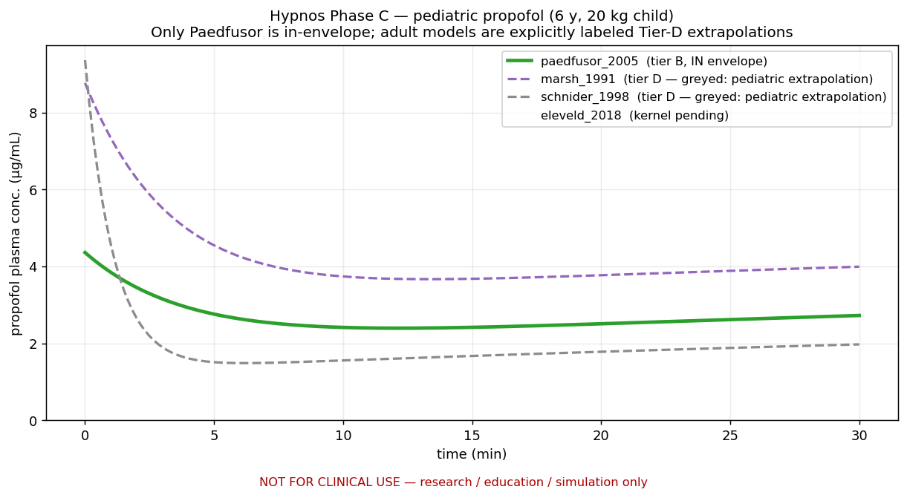
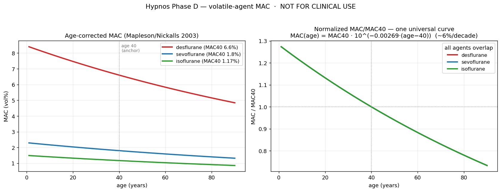
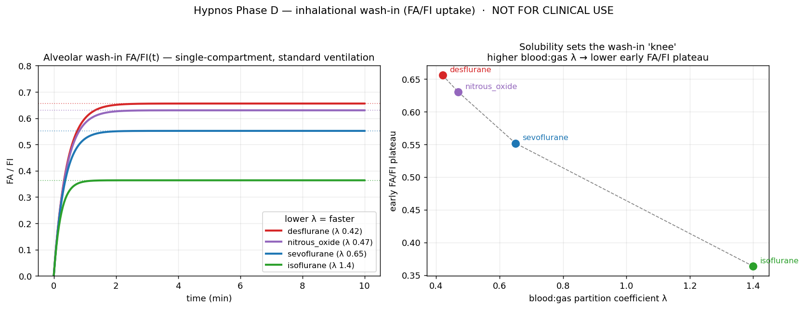
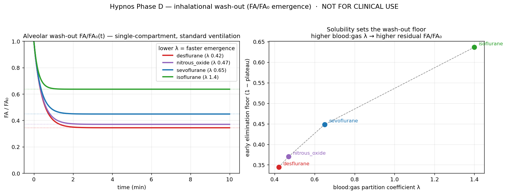
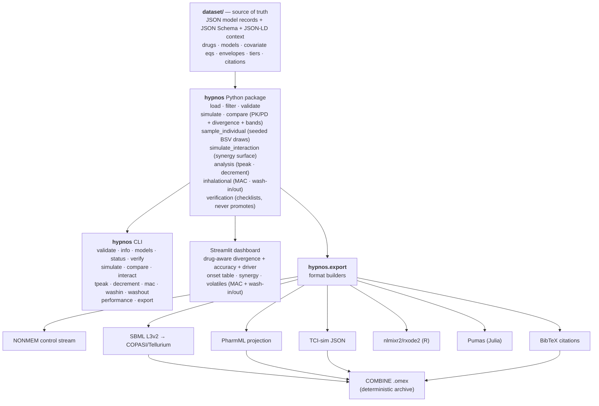
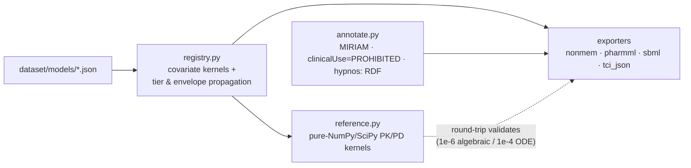
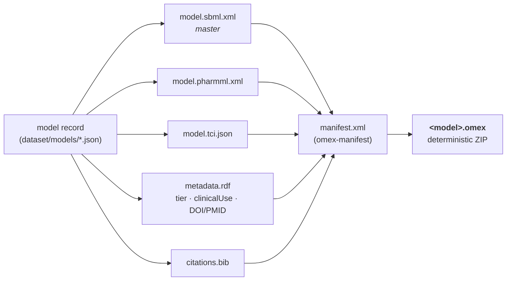

# Hypnos

**A curated, citation-backed dataset of anesthetic and perioperative PK/PD model parameters — annotated with explicit confidence tiers *and applicability envelopes*, with envelope-aware forward simulation and exports into the standard pharmacometric formats (PharmML, NONMEM, nlmixr2/rxode2, Pumas, SBML).**

[](https://github.com/clay-good/hypnos/actions/workflows/ci.yml)
&nbsp;Code: MIT · Dataset: CC-BY-4.0 · Python ≥ 3.9

> ### ⚠️ NOT FOR CLINICAL USE
> Hypnos is **not** a clinical decision-support tool, **not** a TCI pump driver, **not** a dosing calculator, and **not** validated for any decision affecting a real patient. It is for research, method development, education, and simulation only. Every export carries a machine-readable `clinicalUse = "PROHIBITED"` flag. There is **no inverse control** — Hypnos simulates forward (dose → predicted concentration/effect) and will never compute the infusion required to *reach* a target. See [spec §10](docs/specs/v0.1/spec.md).

> *Hypnos* (Greek god of sleep) is the root of *hypnotic*, the drug class at this dataset's core — a piece of mythology that is also a precise technical term in the field. Hypnos is the sibling of [Nidus](https://github.com/), reusing its architecture, tier philosophy, and "infrastructure, not a simulator; honest about uncertainty by default" stance.

---

## The problem: model-selection risk

Total intravenous anesthesia, target-controlled infusion (TCI), closed-loop control, depth-of-anesthesia modeling, and the machine-learning-on-VitalDB community all rest on a small set of **population PK/PD models**. For propofol alone a researcher routinely picks between Marsh, Schnider, Kataria/Paedfusor, and Eleveld. These models:

- live in PDFs from 1991–2018, often paywalled;
- publish parameters in inconsistent parameterizations (volumes/clearances vs. micro-rate constants);
- have **different, often unstated, applicability envelopes** and **documented failure modes** outside them (Schnider's lean-body-mass term misbehaves at high BMI; weight-only Marsh performs poorly in the elderly);
- are re-typed — and quietly mis-typed — into the next paper and the next simulator config.

The field has said so in print: *the availability of multiple PK/PD models for a single drug increases the risk of invalid model selection.* There is open raw data (VitalDB, Open TCI) and there are individual published models, but nothing curated, tiered, and machine-readable in between that says, honestly, **which numbers, for which patient, with what confidence, citing what evidence, and where they break.**

**Hypnos is that layer.**

## The headline feature: the model-divergence view

Pick a virtual patient and a dose schedule. Hypnos overlays the predicted plasma and effect-site curves from *every eligible model*, **greys out** the ones whose envelope the patient violates, and reports the **quantitative divergence** between them — both the pooled peak spread (*how much* they disagree) and the **driver pair**, the two models furthest apart at the instant of peak disagreement (*which* model is the outlier). This makes model-selection risk *visible and measurable*.



Both panels are real output from this repo's `compare()` API (the same one [the dashboard](dashboard/app.py) drives), now overlaying all three adult propofol models (Marsh, Schnider, Eleveld):

- **Left — elderly patient (72 y, 60 kg, F).** All three are in-envelope yet their predicted effect-site peaks span **5.6 µg/mL (169%)**: Schnider spikes to ~8 µg/mL while Marsh and Eleveld rise slowly to ~3.7, driven largely by their different `ke0` (Marsh 0.26, Eleveld ~0.15, Schnider 0.456 min⁻¹). Same drug, same dose — a clinically enormous disagreement a single-model simulator hides.
- **Right — obese patient (40 y, 140 kg, M).** Schnider is **greyed out and auto-tiered to D**: the patient's BMI (47) is outside its derivation envelope *and* triggers the documented James-LBM failure mode (the non-physical early spike). Eleveld — built for broad application including the obese — stays in-envelope at Tier A alongside Marsh. The envelope picks the right tool automatically.

```text
$ hypnos compare --drug propofol --age 40 --weight 140 --height 172 --sex M
included (2):
  - hypnotics_iv.propofol.eleveld_2018         tier A  Ce peak 3.974 ug/mL   MDAPE 22-30%
  - hypnotics_iv.propofol.marsh_1991           tier B  Ce peak 3.741 ug/mL   MDAPE 25%
excluded for envelope (2):
  - hypnotics_iv.propofol.paedfusor_2005       tier D  (pediatric model used in an adult ...)
  - hypnotics_iv.propofol.schnider_1998        tier D  (ENVELOPE: bmi=47.3 outside [20, 42]
        -> tiered down to D; FAILURE MODE [James LBM term inverts] -> tiered down to D)
```

Each included model also reports its **published in-envelope inaccuracy** (MDAPE) next to its curve, so the view answers not just *how much do the models disagree?* but *and how accurate is each one where it's valid?* — the two halves of model-selection risk. The badge deliberately shows only the **in-envelope** MDAPE: a model's out-of-envelope/failure-mode number (e.g. Minto's 53.4% in morbid obesity) applies precisely where that model would itself be greyed out, so it is never attached to an included model.

The same view works for **remifentanil** (`--drug remifentanil`), now with all three models the spec names (Minto, Eleveld, Kim): they agree closely for a standard adult (a useful cross-check), but their envelopes differ sharply at the extremes. For a morbidly-obese patient, only **Kim** (derived in obesity, BMI to ~70) stays in-envelope while Eleveld (BMI to 52) and Minto (James-LBM failure > 40) are greyed; for a child, only **Eleveld** (neonate→adult) covers, with Minto and Kim greyed as adult-only. Agreement where models are jointly valid, honest exclusion where one is not: exactly what a model-selection instrument should show.

## v0.2: the population-variability layer — bands and the second hidden uncertainty

The divergence view above answers *which model did you pick?* — **structural** uncertainty. But a single typical-value curve hides a **second**, equally real uncertainty: even within one model, real individuals scatter around the typical patient. That is the entire reason these are fitted as **non-linear mixed-effects** models — a fixed-effect layer *plus* a random-effect layer (Ω for between-subject variability, Σ for residual error). v0.1 curated the first layer and silently dropped the second. v0.2 curates the second with the **same** tiering, citation, and verification discipline — and, crucially, makes the *relationship between the two* measurable. ([Full design spec.](docs/specs/v0.2/variability.md))



Both panels are real, **seeded, byte-reproducible** output from `compare(..., bands=True, seed=7)` on the same elderly patient:

- **Left — the never-synthesize rule, made visible.** Of the three eligible propofol models, **only Eleveld** publishes the random-effects structure, so only it earns a 5–95% prediction band (shaded). Marsh and Schnider are drawn as bare median lines and **named as excluded** from the band math — Hypnos will not borrow a sibling's Ω or impute a "typical" CV. *A missing band is a true statement; a borrowed one is a lie with error bars.* Notice Schnider's peak (~8 µg/mL) sits **clearly above Eleveld's 95th percentile** — a structural disagreement no amount of within-Eleveld variability explains away.
- **Right — where does the uncertainty come from?** A time-resolved **variance decomposition** of Eleveld's prediction: at the peak (t\* ≈ 3.3 min) **~88% of the within-model predictive variance is between-subject (η / Ω)** and only ~12% is residual assay/model noise (ε / Σ). The honest reading: for this patient the *patient* is the uncertainty, not the measurement — a regime where curating yet another model helps less than the line-spread suggests.

Two machine-readable readouts fall out, both added to `divergence["cp"]`/`["ce"]`:

- **Separation index** — at the instant of peak median spread, are the two driver models' bands **disjoint**? `separation > 0` means a genuine, irreducible structural disagreement that neither model's own stated variability explains; the reported `fraction_trajectory_disjoint` is the share of the curve where the bands separate — *model-selection risk you cannot variability-away.* (It computes once ≥ 2 models carry curated BSV; today Eleveld is the only propofol model that does, so it is reported for drugs/comparisons where two band-eligible models overlap.)
- **Variance decomposition** — the structural / BSV / residual share of the total predictive variance, time-resolved. It tells a researcher *when curating more models helps* (structural-dominated regimes) versus *when the patient is the irreducible uncertainty* (BSV-dominated).

```text
$ hypnos compare --drug propofol --age 72 --weight 60 --height 162 --sex F \
                 --bands --percentile 5,95 --samples 2000 --seed 7
included (3):
  - hypnotics_iv.propofol.eleveld_2018   tier A  Ce peak 3.57  band-tier B  Ce 2.99 [1.15, 7.98]
  - hypnotics_iv.propofol.marsh_1991     tier B  Ce peak 3.74  band-tier — (no published BSV; line only)
  - hypnotics_iv.propofol.schnider_1998  tier B  Ce peak 8.15  band-tier — (no published BSV; line only)
effect-site divergence … peak rel 169%  (driver: schnider_1998 vs marsh_1991)
  variance share @ t*=3.33 min: structural 0.00 | BSV 0.88 | residual 0.12
  note: marsh_1991, schnider_1998 excluded from band metrics (variability_status: none)
```

**Curated for Eleveld 2018 propofol** (the model with the most completely published random-effects structure): the full **Ω diagonal** (ω² on V1/V2/V3/CL/Q2/Q3/ke0, η-scale log-variances — exactly a NONMEM `$OMEGA` diagonal) plus the **log-additive Σ** (σ = 0.191). Cross-checked against the `tci` R package (the same source Hypnos already cross-checks its kernels against) and curated **`unverified`**: the random effects are *more* error-prone to transcribe than the fixed effects (variance vs SD vs CV%, log vs natural scale), so `hypnos validate` recomputes each `cv_percent` from `omega2` and the human checklist confirms the [five §4 traps](docs/specs/v0.2/variability.md#4-the-canonical-representation-and-the-transcription-traps) against the source table. The band carries its **own tier** (B), one rung below the Tier-A median line it surrounds — honest, and visible in the output.

> **Safety, tightened in proportion.** A band makes the output *look* more like a clinical tool, so the guardrails tighten: **no quantile-targeting** ("the dose that keeps the 95th percentile below X" is inverse control wearing a statistical hat — still forbidden), and every band is labeled a statement about *the model's stated uncertainty*, not a claim about a real individual. `clinicalUse = "PROHIBITED"` remains universal.

## Drug–drug interaction: the propofol–remifentanil synergy surface

The clinically dominant TIVA pairing is propofol + remifentanil, and their hypnotic interaction is **supra-additive** (synergistic): adding remifentanil markedly deepens hypnosis at the same propofol dose. Hypnos models this with a Greco-type response surface and a two-drug forward simulator (`simulate_interaction`), composing two independent PK models into one effect.



- **Left** — same propofol dose, ± remifentanil (real output). The opioid pushes BIS from a 27.8 nadir to 14.1.
- **Right** — the Greco surface `E = E0 − Emax·U^γ/(1+U^γ)` with `U = u_prop + u_remi + α·u_prop·u_remi`. The **curved** iso-BIS contours are the synergy: pure additivity (`α = 0`) would draw straight lines. At zero opioid the surface collapses exactly to the propofol-alone sigmoid, so it composes consistently with the PK kernels.

> **Honesty note (same stance as Eleveld).** The response-surface *mathematics* is exact and round-trip validated; the *coefficients* are representative/illustrative (**Tier C, unverified**) pending field-by-field transcription of the Bouillon 2004 surface. The qualitative result — remifentanil spares propofol / deepens hypnosis — is robust; the exact numbers are flagged, not asserted. `simulate_interaction` propagates the **worst** tier among PK-A, PK-B, and the surface (here C), and still tiers down to **D** if either patient covariate set is out of envelope.

```python
ir = hypnos.simulate_interaction(
    ds, "interactions.propofol_remifentanil.greco_bis",
    pk_a="hypnotics_iv.propofol.schnider_1998",
    pk_b="opioids.remifentanil.minto_1997",
    patient=dict(age=40, weight=70, height=170, sex="M"),
    schedule_a=[("bolus", 0, "2 mg/kg"), ("infusion", 0, "6 mg/kg/h")],
    schedule_b=[("bolus", 0, "1 mcg/kg"), ("infusion", 0, "0.25 mcg/kg/min")],
    t=np.linspace(0, 30, 181),
)
ir.effect_min, ir.tier        # 14.1, "C"
```

## Breadth & pediatrics: explicit Tier-D extrapolation labeling

Phase C widens coverage beyond the propofol/remifentanil core — a new drug class (the α₂-agonist **dexmedetomidine**, Hannivoort 2015) and the pediatric propofol model **Paedfusor** — and makes the spec's headline pediatric idea operational: when an adult model is used in a child (or a pediatric model in an adult), Hypnos does not merely flag "out of envelope," it **names the extrapolation and tiers it to D**.



For a 6-year-old, 20 kg child, **three** models are in-envelope: the canonical pediatric pair **Kataria** (Tier C) and **Paedfusor** (Tier B) — the two models the pediatric-TCI literature routinely compares head-to-head ("Kataria vs Paedfusor") — plus the broad-envelope general-purpose **Eleveld** (Tier A), built to span neonate→elderly and so correctly *covering the child by design*. The two adult-only models, **Marsh and Schnider**, are greyed out and explicitly labeled *pediatric extrapolations*: an adult model used in a child is not predictive, so it is floored to Tier D. The labeling is symmetric: any pediatric model (Kataria, Paedfusor) used in an adult is flagged as a pediatric-model extrapolation, and a 90-year-old outside dexmedetomidine's 18–70 y range is labeled a *geriatric extrapolation*. Kataria and Paedfusor are both in-envelope yet disagree on plasma (peaks 4.88 vs 4.36 µg/mL here) — making the pediatric model-selection question measurable, the headline feature applied to children.

```text
$ hypnos compare --drug propofol --age 6 --weight 20 --height 115 --sex M
included (3):
  - hypnotics_iv.propofol.eleveld_2018         tier A  Ce peak 2.474 ug/mL   # broad envelope covers the child
  - hypnotics_iv.propofol.kataria_1994         tier C  Cp peak 4.878 ug/mL   # canonical pediatric model
  - hypnotics_iv.propofol.paedfusor_2005       tier B  Cp peak 4.363 ug/mL   # the other half of the pair
excluded for envelope (2):
  - hypnotics_iv.propofol.marsh_1991      tier D  (... PEDIATRIC EXTRAPOLATION: age 6 y is below the
        model's derivation range (>= 16 y); an adult model used in a child is not predictive -> Tier D)
  - hypnotics_iv.propofol.schnider_1998   tier D  (... PEDIATRIC EXTRAPOLATION ...)
```

## Inhalational agents: a different parameter convention (MAC)

Phase D brings in the non-IV families, which do **not** fit compartmental PK. Volatile anaesthetics are characterized by **MAC** (minimum alveolar concentration), its **age correction**, and **partition coefficients** — a distinct, first-class `physicochemical` model type with its own kernel. Hypnos ships sevoflurane, desflurane, isoflurane, and nitrous oxide, and evaluates age-corrected MAC, the MAC fraction (a depth surrogate), and the *additive* combined MAC fraction when nitrous oxide is co-administered.



The age correction is the verified, load-bearing relation (Nickalls & Mapleson 2003): `MAC(age) = MAC40 · 10^(−0.00269·(age−40))`, ~6% per decade and **universal** across agents — the right panel shows all three potent agents collapsing onto a single normalized curve. Envelope enforcement applies here too (the relation is valid for age > 1 y).

```text
$ hypnos mac --agent sevoflurane --age 75 --end-tidal 1.2 --n2o 50
MAC (age-corrected): 1.45 vol%   (MAC40 1.8)        # 75 y reduces MAC ~19% below the age-40 anchor
end-tidal 1.2 vol% -> MAC fraction 0.83
+ N2O 50 vol% -> combined MAC fraction 1.43          # MAC fractions are additive
```

```python
hypnos.mac(ds, "volatiles.sevoflurane.mac", age=75, end_tidal_pct=1.2, n2o_end_tidal_pct=50).combined_mac_fraction
```

**Uptake — the solubility-driven wash-in.** The other half of volatile pharmacology is *uptake*: how fast the alveolar fraction `FA` rises toward the inspired `FI`. It is governed by the **blood:gas partition coefficient** `λ` already in each record — and Hypnos computes it with a single-compartment alveolar mass balance (`hypnos washin`):

```text
FA/FI(t) = plateau · (1 − e^(−t/τ)),   plateau = V̇_A/(V̇_A + λ·Q̇),   τ = FRC/(V̇_A + λ·Q̇)
```



The left panel is the FA/FI wash-in; the right makes the mechanism explicit — early plateau falls monotonically as blood:gas `λ` rises. Both are computed from the curated coefficients alone.

```text
$ hypnos washin
agent             λ(blood:gas)  plateau  τ(min)   FA/FI@3min
desflurane                0.42    0.656    0.41        0.655
nitrous_oxide             0.47    0.630    0.39        0.630
sevoflurane               0.65    0.552    0.34        0.552
isoflurane                 1.4    0.364    0.23        0.364
```

The discriminating quantity is the **early FA/FI plateau** (the wash-in "knee" reached before tissue uptake dominates): a *less* soluble agent has a *higher* plateau and rises toward it faster, reproducing the canonical ordering — desflurane and nitrous oxide wash in fast, isoflurane slowly — straight from the curated coefficients. Honesty boundary, same stance as the Greco surface: the math is exact, but it rests on **stated, standard 70-kg-adult ventilation constants** (V̇_A ≈ 4 L/min, FRC ≈ 2.5 L, Q̇ ≈ 5 L/min, all overridable). It is a comparative, education-grade characterization, **not** a per-patient FA/FI predictor; full multi-compartment tissue uptake (Mapleson) is out of v0.1 scope.

**Offset — the wash-out mirror (emergence).** Onset has an offset. Run the same alveolar mass balance with the inspired fraction set to zero (and the symmetric early-phase idealization that tissues are still saturated, so blood *redelivers* agent), and it integrates to the exact mirror of wash-in — falling from 1 toward an **elimination floor** rather than rising toward a plateau (`hypnos washout`):

```text
FA/FA₀(t) = floor + (1 − floor)·e^(−t/τ),   floor = λ·Q̇/(V̇_A + λ·Q̇) = 1 − plateau,   same τ
```



```text
$ hypnos washout
agent             λ(blood:gas)   floor  τ(min)   FA/FA0@3min
desflurane                0.42   0.344    0.41        0.345
nitrous_oxide             0.47   0.370    0.39        0.370
sevoflurane               0.65   0.448    0.34        0.448
isoflurane                 1.4   0.636    0.23        0.636
```

The discriminator flips sign but tells the same story: a *less* soluble agent has a *lower* floor, so it washes out more completely and faster — desflurane settles toward 0.34 while isoflurane holds at 0.64. This is the physicochemical reason desflurane is chosen for long cases (faster emergence), now computable from the curated `λ` alone. Same honesty boundary as wash-in, and the same scope limit: this captures only the early, lung-dominated phase — the long tissue-release tail (full Mapleson) is out of v0.1. With `floor = 1 − plateau` and a shared τ, wash-in and wash-out are one model run in two directions, giving the volatiles the onset→offset symmetry the IV families have via `tpeak`/`decrement`.

**Neuromuscular blockers** are seeded: a **train-of-four (T1 twitch) sigmoid** PD record (the NMB convention — a steep Hill curve on a twitch-height scale, Ce50 ≈ 0.82 µg/mL at the adductor pollicis) composes onto a rocuronium PK model that is curated but **kernel-pending** (the Wierda 1991 compartmental parameters aren't openly reconcilable, so `simulate()` refuses it). Sugammadex reversal (1:1 encapsulation binding kinetics) is deferred — it needs its own model type, like the deferred local-anesthetics subsystem.

## Install & quickstart

```bash
git clone https://github.com/clay-good/hypnos
cd hypnos
pip install -e ".[dev]"          # add ",dashboard" for the Streamlit UI

hypnos version
hypnos validate                  # JSON-Schema + integrity checks on the dataset
hypnos info                      # counts by subsystem / tier / review status
hypnos compare --drug propofol --age 72 --weight 60 --height 162 --sex F
```

```python
import numpy as np
import hypnos

ds = hypnos.load()
m = ds["hypnotics_iv.propofol.schnider_1998"]
m.tier                                      # "B"
m.applicability_envelope.weight_kg          # Range(min=44, max=123)
m.review_status                             # "unverified"

# Forward simulation (NO inverse control, by design)
patient = dict(age=72, weight=60, height=162, sex="F")
schedule = [("bolus", 0.0, "2 mg/kg"), ("infusion", 0.0, "6 mg/kg/h")]
t = np.linspace(0, 60, 361)
res = hypnos.simulate(ds, m.id, patient=patient, schedule=schedule, t=t,
                      pd_model="pd_effect.propofol.bis_sigmoid")
res.cp, res.ce, res.effect      # plasma, effect-site conc, BIS trajectory
res.tier, res.warnings          # propagated tier + envelope/failure-mode warnings

# Model-divergence comparison — the headline feature
cmp = hypnos.compare(ds, drug="propofol", patient=patient, schedule=schedule, t=t)
cmp.divergence["ce"]            # {'max_abs': 5.62, 'max_rel': 1.69, 'driver': {'high': '...schnider_1998', 'low': '...marsh_1991', 'gap': 5.62}}
cmp.excluded                    # models greyed out for envelope violation, with reasons

# v0.2 — seeded prediction bands + uncertainty-aware divergence
res = hypnos.simulate(ds, "hypnotics_iv.propofol.eleveld_2018", patient=patient,
                      schedule=schedule, t=t, bands=True, percentile=(5, 95),
                      samples=2000, seed=7)
res.ce_quantiles                # {5: array, 50: array, 95: array}; None if no published BSV
res.band_tier                   # "B" — the band's own tier, ≤ the median-line tier

cmp = hypnos.compare(ds, drug="propofol", patient=patient, schedule=schedule, t=t,
                     bands=True, seed=7)
cmp.divergence["ce"]["variance_share"]   # {'structural': .., 'bsv': .., 'residual': ..}
cmp.divergence["ce"].get("separation")   # disjoint-band test (≥2 band-eligible models)
cmp.excluded_from_bands                  # models with no published BSV, named (never fabricated)
```

## How it works

The **dataset is the single source of truth.** Everything else — simulation, exports, the dashboard — is a deterministic projection of the JSON. No second store of numbers to drift.





### The model record — the unit of curation

One JSON file = one model of one drug for one purpose (e.g. *propofol PK — Schnider 1998*). Validated against [`dataset/schema/model.schema.json`](dataset/schema/model.schema.json). Two fields carry the anesthesia-specific load-bearing ideas:

- **`applicability_envelope`** — the covariate ranges the model was actually derived in. First-class, machine-readable, **enforced by the simulator**.
- **`known_failure_modes`** — documented, cited ways a model misbehaves, each with a machine-evaluable `predicate` (e.g. `"bmi > 42"`) and an `action` (`tier_down_to_D` / `warn` / `exclude`).
- **`variability` / `residual_error` / `omega_block` (v0.2, optional)** — the random-effects layer: per-parameter `bsv.omega2` (η-scale variance), the Σ residual model, off-diagonal Ω, and a `variability_status` rollup. Each carries its **own tier** and extraction status; absence renders as an explicit gap (no band), never a fabricated one.

### Confidence tiers and how they propagate

| Tier | Meaning |
| --- | --- |
| **A** | Externally validated across ≥2 independent populations; broad covariate range; acceptable predictive performance (\|MDPE\| ≲ 10–20%, MDAPE ≲ 20–30%). |
| **B** | One robust population model with ≥1 external validation; performance reported and reasonable. |
| **C** | Single small/narrow derivation cohort; little/no external validation. |
| **D** | Used outside its derivation envelope, or an extrapolation, or a hypothesized link with no quantitative validation. **Not predictive.** |

Two rules, enforced in code and by `hypnos validate`:

1. **Worst input wins.** A record's tier equals the worst tier among its parameters. A composed simulation (PK + `ke0` + PD) inherits the worst tier among its components. *Example: Schnider PK (B) + BIS sigmoid (C) ⇒ the BIS trajectory is reported as Tier **C**.*
2. **Envelope violations force a Tier-D floor.** Any request outside the envelope, or that trips a failure-mode predicate, is auto-tiered to **D** with an attached warning. You cannot launder an extrapolation into an A. Age extrapolations are **named**: a sub-range patient in an adult model is a *pediatric extrapolation*, an over-range patient in a pediatric model is flagged as such, and a ≥65 y patient above an adult model's range is a *geriatric extrapolation*.

**The tier has a numeric counterpart.** Pharmacometrics measures predictive accuracy with Varvel's metrics — **MDPE** (median performance error = bias, signed) and **MDAPE** (median absolute performance error = inaccuracy), plus wobble and divergence — so a tier is not purely editorial (spec §5). Hypnos carries these as cited `predictive_performance` rows and surfaces them with `hypnos performance` (or `hypnos.performance_table(ds)`); every row resolves to a real citation with a DOI (`hypnos validate` enforces it — a performance number is never asserted bare). Coverage spans both headline drugs and the α₂-agonist class:

- **Propofol trio** — an independent head-to-head external validation ([Hüppe 2020](https://doi.org/10.1016/j.bja.2019.10.019): Eleveld MDAPE 22%, Marsh 25%, Schnider 26% over 50 surgical adults).
- **Dexmedetomidine** (Hannivoort) — best of nine published models in a spinal-anesthesia external validation ([Obara 2018](https://doi.org/10.1007/s00540-017-2424-1): MDPE 5.6%, MDAPE 18.1%, wobble 6.2%).
- **Minto remifentanil** carries *both* an in-envelope number and the price of leaving the envelope: MDPE −17.3% / MDAPE 24.6% in cardiac surgery ([Scherrer 2022](https://doi.org/10.1016/j.bja.2022.05.003)), against MDAPE **53.4%** in morbid obesity ([La Colla 2010](https://doi.org/10.2165/11317690-000000000-00000)) — the latter a number that *quantifies a documented failure mode* (the James-LBM term in the obese), the authors' "not clinically acceptable" made machine-readable.

### Reference kernels & validation

Every model with `kernel.implemented = true` binds to a **pure-NumPy/SciPy reference kernel** ([`reference.py`](python/hypnos/reference.py)):

- an n-compartment mammillary linear-ODE PK solver, integrated **exactly** via the augmented matrix exponential (machine precision, robust even when `ke0 = 0`);
- the effect-compartment first-order `ke0` link;
- the sigmoid E_max / Hill PD transform (propofol→BIS, rocuronium→train-of-four), single-slope and the Eleveld two-slope variant (asymmetric Hill about Ce50);
- the two-drug Greco response surface;
- the volatile MAC age-correction (Mapleson/Nickalls) and the single-compartment alveolar wash-in / wash-out (FA/FI uptake and FA/FA₀ emergence, mirror-image: `floor = 1 − plateau`, shared τ) — non-compartmental, physicochemical kernels.

Validation, run in CI ([test suite](python/tests)):

- **Analytic vs. independent numeric** — the matrix-exponential solver is checked against a separate `scipy.solve_ivp` integration (≤ 1e-4 relative) and against the closed-form one-compartment bolus solution (≤ 1e-7).
- **Export round-trip** — each SBML / TCI-JSON / rxode2 / Pumas export is parsed back, re-simulated, and compared to the kernel (≤ 1e-6 algebraic). An export bug cannot ship silently.
- **NONMEM `$THETA` fidelity** — emitted thetas are asserted equal to the instantiated parameters; the **v0.2** `$OMEGA`/`$SIGMA` are emitted from the curated `omega2`/residual model with `EXP(ETA(.))` wired into `$PK`, and a no-BSV model keeps `0 FIX` with the missing component named. The off-diagonal `$OMEGA BLOCK` path is exercised against a synthetic complete block (front-anchored covariance, non-contiguous fall-back), and the rxode2/Pumas population blocks are asserted to derive the **same** typical micro-constants the median model emits (η=0 collapses the band to the line).
- **`.omex` determinism** — the COMBINE archive is byte-identical across runs (fixed timestamps); CI rebuilds it and validates the manifest, so an archive bug cannot ship silently.
- **effect-site divergence is computed only over models that carry a `ke0` link** — a PK-only model (e.g. Kim remifentanil, Paedfusor) has `ce = 0` and is excluded from the effect-site spread so it cannot manufacture a spurious divergence; plasma divergence still spans every model.

### Export formats

Exports are generated artifacts, never hand-edited (CI regenerates them), each instantiated at a stated reference patient and carrying the propagated tier, the verbatim covariate equations, MIRIAM `bqmodel:isDerivedFrom` DOI/PMID links, and the universal `clinicalUse = PROHIBITED` flag.

| Format | Role | Status |
| --- | --- | --- |
| **NONMEM** control stream (`$PK`/`$THETA`/`$OMEGA`/`$SIGMA`) | Lingua franca of population PK | ✅ ADVAN11/TRANS4; **v0.2** emits the real `$OMEGA` diagonal + `$SIGMA` where BSV is curated (and `$OMEGA BLOCK` for a complete off-diagonal block; else `0 FIX`) |
| **SBML** L3v2 | Compartmental ODE → COPASI/Tellurium; continuity with Nidus | ✅ rate-rule form, round-tripped (typical-value only — SBML core cannot express population random effects) |
| **TCI-sim JSON** | Clean ingestable JSON for the open-TCI/simulator community | ✅ round-tripped; **v0.2** carries the `variability` block losslessly |
| **PharmML** (projection) | The "SBML of PK/PD"; durable interop anchor | ✅ structural + params + provenance; **v0.2** first-class `VariabilityModel` (η→`RandomEffect`, ε→`ResidualError`) |
| **nlmixr2 / rxode2** (R) | Open-source pharmacometric estimation & simulation | ✅ round-tripped; **v0.2** runnable `<id>_pop` companion (`lotri` Ω + `cp ~ lnorm/prop/add` Σ) |
| **Pumas** (Julia) | Modern open pharmacometric simulation | ✅ round-tripped; **v0.2** `<id>_pop` `@param`/`@random`/`@derived` NLME block |
| **COMBINE `.omex`** | Provenance-bundled archive (SBML+PharmML+TCI-JSON+RDF+BibTeX) | ✅ deterministic, manifest-validated |
| **BibTeX** | Citation export (cite Hypnos *and* the source) | ✅ per-model + dataset |
| **CSV** | Flat parameter export (one row per parameter, DOI/PMID joined) | ✅ per-model + dataset |

```nonmem
; HYPNOS EXPORT — NOT FOR CLINICAL USE
;   clinicalUse = PROHIBITED — research/education/simulation only
;   model: hypnotics_iv.propofol.schnider_1998  (tier B, review: unverified)
; Population covariate equations (verbatim from source):
;   Cl1: Cl1 = 1.89 + 0.0456*(WGT-77) - 0.0681*(LBM-59) + 0.0264*(HGT-177)
$SUBROUTINES ADVAN11 TRANS4
$THETA
  1.78948   ; 1 CL  (L/min)
  4.27      ; 2 V1  (L)
  ...
; bqmodel:isDerivedFrom = https://doi.org/10.1097/00000542-199805000-00006
```

**The v0.2 random-effects layer projects to every population format** (here Eleveld propofol, the one model carrying a curated Ω/Σ). A single shared projection (`export/_variability.py`) renders the η-scale Ω diagonal and the Σ residual model in each ecosystem's native idiom — so the *population* model, not just its typical patient, round-trips:

```r
# nlmixr2 / rxode2 — a runnable population companion (eta=0 collapses to the median line)
hypnotics_iv_propofol_eleveld_2018_pop <- rxode2({
  Cl1 <- 1.922638103 * exp(eta.Cl1)      # log-normal BSV on each disposition parameter
  V1  <- 6.47078481  * exp(eta.V1)
  ...
  k10 <- Cl1 / V1 ; k12 <- Cl2 / V1 ; ...   # micro-constants derived → round-trip exact
  cp = A1 / V1
  cp ~ lnorm(0.191)                       # Σ: log-additive residual
})
hypnotics_iv_propofol_eleveld_2018_omega <- lotri({
  eta.Cl1 ~ 0.265   # CV~55%     eta.V1 ~ 0.61   # CV~92%   ...   eta.ke0 ~ 0.702  # CV~101%
})
```

```xml
<!-- PharmML — random effects are first-class -->
<VariabilityModel bandTier="B" variabilityStatus="diagonal">
  <VariabilityLevel symbol="indiv" type="betweenSubject"/>
  <RandomEffect symbol="eta_Cl1" parameter="Cl1" level="indiv" distribution="Normal"
                transformation="log" variance="0.265" cvPercent="55.08"/>
  ...
  <ResidualError model="log" description="log-additive (≈ proportional on natural scale)" logSd="0.191"/>
</VariabilityModel>
```

NONMEM emits the matching `$OMEGA` diagonal (and a real `$OMEGA BLOCK` when a *complete* off-diagonal block is curated — covariance `r·√(ωᵢ²ωⱼ²)` over a contiguous η run, honest diagonal-plus-caveat otherwise); Pumas emits a `@param`/`@random`/`@derived` NLME block; TCI-JSON carries the block verbatim. A model with **no** published BSV (Marsh, Schnider) emits none of this and names the missing component — the never-synthesize rule, all the way through the export layer.

### The COMBINE `.omex` archive — the distribution unit

One `.omex` (a ZIP with a COMBINE `omex-manifest`) bundles a model's SBML (master) + PharmML + TCI-JSON + a provenance `metadata.rdf` + a `citations.bib`, so the model travels with its interop projections, its confidence tier, its DOI/PMID provenance, and the `clinicalUse` flag in one self-describing file.



Archives are written with **fixed entry timestamps**, so a given dataset version always yields **byte-identical** bytes — a reproducibility guarantee CI enforces.

```bash
hypnos export --format omex   --output exports/hypnos.omex   # one archive, all PK models
hypnos export --format omex   --output exports/omex/          # one .omex per model
hypnos export --format bibtex --output exports/               # citations.bib
python scripts/regenerate.py                                  # regenerate every export + figures
```

## Current coverage (v0.2.0 — v0.1 A–E complete · v0.2 variability V0–V3 export code)

Honest status. A is the propofol spine; B adds the dominant opioid and the interaction surface; C widens to a new drug class and pediatrics; D brings in the non-IV families; E hardens for release (COMBINE `.omex`, BibTeX, reproducibility, verified MDPE/MDAPE) ([v0.1 roadmap](docs/specs/v0.1/spec.md#11-phased-roadmap)). **v0.2** adds the [population-variability layer](docs/specs/v0.2/variability.md) — Ω/Σ random effects, seeded prediction bands, and uncertainty-aware divergence (Eleveld propofol curated; bands + separation index + variance decomposition live; **all five population exports — NONMEM `$OMEGA`/`$OMEGA BLOCK`/`$SIGMA`, PharmML, nlmixr2/rxode2, Pumas, TCI-JSON — carry the random-effects layer**). The only V3 item left is the never-invent BSV *data* backfill for the other models, blocked on source-table confirmation. **19 models · 9 drugs · 7 subsystems · 17 executable kernels · 9 export formats · 1 model with a curated random-effects layer.**

| Model | Record | Kernel | Tier | Notes |
| --- | --- | --- | --- | --- |
| Propofol PK — **Marsh 1991** | ✅ | ✅ executable | B | Weight-only; warns in elderly. |
| Propofol PK — **Schnider 1998** | ✅ | ✅ executable | B | Age/weight/height/James-LBM; high-BMI failure mode encoded. |
| Propofol PK — **Eleveld 2018** | ✅ | ✅ executable | A | General-purpose, broad envelope (neonate→obese elderly). Kernel transcribed from the published equations (cross-checked vs the `tci` R package), validated to reproduce the reference individual exactly; `review_status` stays **`unverified`** pending human PDF confirmation. **v0.2:** carries the curated Ω-diagonal + log-additive Σ (band-tier B) — the only model with a random-effects layer today. |
| Propofol PK — **Paedfusor 2005** | ✅ | ✅ executable | B | Pediatric (1–12 y); the Tier-D extrapolation showcase, in both directions. |
| Propofol PK — **Kataria 1994** | ✅ | ✅ executable | C | Pediatric (3–11 y, n=53); the canonical "Kataria vs Paedfusor" pair. Weight-proportional with an age term on V2; PK-only. Transcribed from the standard published set (Shafer/STANPUMP lineage); `unverified`. |
| Propofol PD — **BIS sigmoid** | ✅ | ✅ executable | C | Single-slope effect-site → BIS; composes onto any PK model and floors the tier to C. |
| Propofol PD — **Eleveld two-slope BIS** | ✅ | ✅ executable | B | Validated PD companion to the Eleveld PK kernel; asymmetric Hill (γ=1.47 below Ce50, 1.89 above), age-corrected Ce50. A fully-Eleveld PK-PD BIS trajectory. |
| Remifentanil PK — **Minto 1997** | ✅ | ✅ executable | B | Age + James-LBM; shares the high-BMI LBM failure mode; reported in ng/mL (the opioid convention). |
| Remifentanil PK — **Eleveld 2017** | ✅ | ✅ executable | A | Allometric (FFM) general-purpose; broad envelope (neonate→obese elderly), faster `ke0` than Minto. Validated to reference; `unverified`. Found+fixed a V3 reference typo in the `tci` source. |
| Remifentanil PK — **Kim 2017** | ✅ | ✅ executable | A | Derived in obesity (Janmahasatian FFM, BMI to ~70); widest obesity envelope of the trio. PK-only (no published `ke0`). Validated to reference; `unverified`. |
| Dexmedetomidine PK — **Hannivoort 2015** | ✅ | ✅ executable | B | New drug class (α₂-agonist); allometric (vol ^1, CL ^0.75); adult-only, narrow BMI. |
| Fentanyl PK — **Shafer 1990** | ✅ | ⏳ pending | C | Curated record with verified citation; kernel deferred — secondary sources disagree on the exact micro-rate constants, so `simulate()` refuses it. |
| Interaction — **propofol×remifentanil** (Greco/BIS) | ✅ | ✅ executable | C | Two-drug response surface; math exact and round-tripped, **coefficients illustrative/unverified** pending Bouillon-2004 transcription. |
| Volatiles — **sevoflurane · desflurane · isoflurane · N₂O** (MAC) | ✅ | ✅ executable | B | New `physicochemical` type: MAC40 + Mapleson age-correction + partition coefficients; MAC fraction + nitrous-oxide additivity. |
| Rocuronium PK — **Wierda 1991** | ✅ | ⏳ pending | C | Seeds `nmb_agents`; kernel deferred (compartmental params not openly reconcilable). |
| Rocuronium PD — **train-of-four sigmoid** | ✅ | ✅ executable | C | NMB convention: steep Hill on twitch-height; Ce50 ≈ 0.82 µg/mL (adductor pollicis). Composes onto a rocuronium PK kernel once verified. |

> **Implemented but still `unverified` — the distinction that matters.** Eleveld's covariate equations (post-menstrual-age maturation, allometric scaling, BMI/age sigmoids) are exactly where transcription errors hide (spec §9). The kernel was transcribed from the published equations, cross-checked against the open `tci` R implementation, and validated to reproduce the reference individual (V1=6.28, CL=1.79, ke0=0.146) to the decimal. It still reads `unverified`, because **reproducing one reference point is not a human confirming every covariate equation against the PDF.** Promoting it to `verified` is the next highest-leverage contribution — run `hypnos verify hypnotics_iv.propofol.eleveld_2018` for the checklist. Models whose parameters cannot even be reconciled to a primary source (rocuronium PK, Shafer fentanyl) stay kernel-pending and `simulate()` refuses them.

## Verification: the single highest-leverage contribution

Every model ships `unverified` and the dataset says so out loud. Promotion to `verified` requires a human to open the source PDF and confirm, field by field, every structural parameter **and** every covariate equation (the covariate equations are where published-vs-implemented divergence hides). **LLMs may assist but never promote** — nothing automated writes `review_status = verified`.

Hypnos ships tooling to *support* that work without doing it for you:

```text
$ hypnos status
verification coverage: 0/19 verified (0%)   unverified 19   contested 0

start here (highest-leverage unverified models — implemented kernel + best tier first):
  - hypnotics_iv.propofol.eleveld_2018               tier A  kernel   cite eleveld-2018-propofol
  - opioids.remifentanil.eleveld_2017                tier A  kernel   cite eleveld-2017-remifentanil
  - opioids.remifentanil.kim_2017                    tier A  kernel   cite kim-2017-remifentanil
  ...

$ hypnos verify hypnotics_iv.propofol.schnider_1998 --markdown   # copy-pasteable PR checklist
```

`hypnos verify <id>` emits the field-by-field checklist — each parameter, each covariate equation (e.g. the James LBM term), the envelope, the derivation population, and the DOI to confirm — as plain text or markdown for a PR. The prioritization is deliberate: models with an implemented kernel and the best tier come first, because verifying those unlocks trustworthy simulation. See the essay [*Why model-selection risk is the load-bearing idea*](docs/about/essay.md) for the philosophy, and [CONTRIBUTING.md](CONTRIBUTING.md) for the checklist rules.

## Design decisions

| Decision | Rationale |
| --- | --- |
| **Pure Python** (NumPy/SciPy); R/Julia only as export targets | Nothing is compute-bound; the R/Julia models are generated artifacts, not a runtime dependency. |
| **Dataset is the centerpiece; everything else is a projection** | The durable contribution is the curated, tiered, envelope-annotated models — not any one viewer or solver. |
| **Envelope + failure modes are first-class and machine-enforced** | Model-selection risk is the core pain; making the envelope enforceable is the load-bearing idea. |
| **Tier & envelope warnings propagate; worst input wins** | A composed simulation is only as trustworthy as its weakest component or furthest extrapolation. |
| **Humans verify; LLMs do not promote** | `unverified → verified` requires reading the source PDF and confirming the parameters *and the covariate equations*. Even Eleveld — implemented and validated to its reference patient — stays `unverified`; that flag means *a human has checked the PDF*, nothing less. Models whose parameters cannot be reconciled to a primary source (rocuronium PK, Shafer fentanyl) stay kernel-pending and `simulate()` refuses them. |
| **Age extrapolations are named, not just flagged** | "Out of envelope" is generic; "pediatric extrapolation of an adult model" is the actual clinical risk the spec calls out. The label is first-class and tested. |
| **One internal concentration unit (µg/mL), conventional units for display** | The kernels work in µg/mL (= mg/L) throughout; each drug declares its conventional unit so output reads naturally (ng/mL for opioids and dexmedetomidine). The CLI likewise uses drug-appropriate default doses — a 2 mg/kg propofol regimen applied to remifentanil would be a ~1000× overdose. |
| **No TCI engine, no dosing output, ever** | The line between "research simulator" and "unregulated medical device" is exactly the inverse-control step. Hypnos stays on the safe side by construction. |
| **Forward characterizations only — onset and offset, not constant-conc CSHT** | Onset (`tpeak`: bolus → peak Ce, where Ce = Cp) and offset (`decrement`: plasma decline after a fixed-*rate* infusion) are pure forward problems and in scope. Classic context-sensitive half-time needs a target-controlled infusion holding plasma *constant* (inverse control), so it is deliberately excluded. The `decrement` metric still shows the same context-sensitivity: it lengthens with infusion duration for propofol (1.0→4.2 min over 10→600 min) yet stays near-flat for remifentanil (~2.2 min) — its celebrated property. The safety boundary even shapes which metrics exist. |
| **Exact matrix-exponential solver, memoized** | Closed-form per segment for a linear time-invariant system; more accurate than stepwise integration, and the augmented form handles `ke0 = 0` without a singular inverse. The propagator is memoized by `(dt, rate)`, so a uniform grid costs ~1 matrix exponential instead of one per step (≈70× faster at n=361; identical results). |

## Repository layout

```
hypnos/
├── README.md · LICENSE (MIT, code) · LICENSE-DATASET (CC-BY-4.0, data)
├── CITATION.cff · CONTRIBUTING.md · pyproject.toml
├── dataset/                     # the single source of truth
│   ├── schema/                  # JSON Schema + JSON-LD context
│   ├── drugs/ · models/ · citations/
│   └── VERSION
├── python/hypnos/
│   ├── load.py · filter.py · validate.py · models.py
│   ├── reference.py             # pure-NumPy/SciPy PK/PD kernels
│   ├── simulate.py              # forward simulation + compare + interaction (no inverse control)
│   ├── inhalational.py          # volatile MAC API (age correction, fraction, N2O additivity) + wash-in/out (FA/FI · FA/FA₀)
│   ├── analysis.py              # derived characterizations (time-to-peak-effect; forward-only)
│   ├── verification.py          # verification checklists + coverage (guides humans; never promotes)
│   ├── cli.py
│   └── export/                  # registry · annotate · _variability(Ω/Σ projection) · nonmem · pharmml · sbml · tci_json · rxode2 · pumas · bibtex · csv_flat · combine(.omex)
├── scripts/regenerate.py        # deterministically regenerate all exports + figures
├── notebooks/                   # reference notebooks executed in CI (nbmake)
├── CHANGELOG.md · .zenodo.json   # release metadata (Zenodo DOI on first tagged release)
├── python/tests/                # analytic-vs-numeric, round-trip, envelope, tier, CLI, verification
├── dashboard/app.py             # Streamlit: drug-aware divergence + onset + synergy + volatiles (MAC/wash-in/out)
├── docs/about/essay.md          # why model-selection risk is the load-bearing idea
├── docs/specs/v0.1/spec.md      # the design spec (typical-value layer)
├── docs/specs/v0.2/variability.md  # the population-variability layer (Ω/Σ, bands)
└── .github/workflows/ci.yml
```

## Cheat sheet

```bash
hypnos version
hypnos validate                                   # schema + integrity (citations, tiers, kernels, envelopes)
hypnos info                                       # counts by subsystem / tier / review status
hypnos models [--drug propofol]                   # list models (id / purpose / tier / kernel / review)
hypnos performance [--drug propofol]              # published MDPE/MDAPE/wobble/divergence, cited
hypnos status                                     # verification coverage + what to verify next
hypnos verify <model_id> [--markdown]             # field-by-field verification checklist
hypnos simulate <model_id> --age .. --weight .. --height .. --sex .. [--pd <pd_id>]
hypnos compare  --drug propofol --age .. --weight .. --height .. --sex ..
hypnos compare  --drug propofol --age .. ... --bands --percentile 5,95 --samples 2000 --seed 7  # v0.2 prediction bands + uncertainty-aware divergence
hypnos interact --age .. --weight .. --height .. --sex ..             # propofol+remifentanil synergy
hypnos mac --agent sevoflurane --age 75 [--end-tidal 1.2] [--n2o 50]  # age-corrected MAC + fraction
hypnos washin  [--agent sevoflurane]                                 # inhalational wash-in (FA/FI uptake), solubility-driven
hypnos washout [--agent sevoflurane]                                 # inhalational wash-out (FA/FA₀ emergence), the offset mirror
hypnos tpeak <model_id> --age .. --weight .. --height .. --sex ..    # time to peak effect (onset)
hypnos decrement <model_id> --duration 240 [--infusion '6 mg/kg/h']  # plasma decrement time (offset)
hypnos export   --format {nonmem,pharmml,sbml,tci_json,rxode2,pumas,bibtex,csv,omex} --output exports/ [--model <id>]
python scripts/regenerate.py                                          # regenerate all exports + figures
streamlit run dashboard/app.py
```

```python
ds = hypnos.load()
hypnos.select(ds, drug="propofol", purpose="pk", kernel_only=True)   # filter
hypnos.summary(ds)                                                    # dataset stats
hypnos.performance_table(ds, drug="propofol")                        # published MDPE/MDAPE rows (cited)
ds[model_id].predictive_mdape                                        # in-envelope MDAPE shown in the divergence view
hypnos.simulate(ds, model_id, patient=..., schedule=..., t=...)       # forward sim
hypnos.compare(ds, drug=..., patient=..., schedule=..., t=...)        # divergence view
hypnos.simulate(ds, model_id, ..., bands=True, seed=7)               # v0.2: seeded prediction band -> .ce_quantiles/.band_tier
hypnos.compare(ds, drug=..., ..., bands=True, seed=7)                # v0.2: .divergence[..]["separation"]/["variance_share"]
hypnos.simulate_interaction(ds, surface_id, pk_a=.., pk_b=.., ...)    # two-drug response surface
hypnos.mac(ds, agent_id, age=.., end_tidal_pct=.., n2o_end_tidal_pct=..)  # volatile MAC + fraction
hypnos.washin_comparison(ds)                                         # inhalational wash-in (FA/FI) across agents
hypnos.washout_comparison(ds)                                        # inhalational wash-out (FA/FA₀ emergence) across agents
hypnos.time_to_peak_effect(ds, model_id, patient=..)                 # onset: tpeak after a bolus
hypnos.decrement_time(ds, model_id, patient=.., infusion=.., duration=..)  # offset: plasma decrement
res.cp_peak_display, res.concentration_unit                          # conventional units (ng/mL for opioids)
hypnos.verification_summary(ds)                                       # coverage + next-to-verify
hypnos.model_verification(ds, model_id)                              # field-by-field checklist object
hypnos.validate_dataset(ds)                                           # -> list of problems ([] == valid)
```

## Licensing & citation

- **Code:** MIT ([`LICENSE`](LICENSE)).
- **Dataset:** CC-BY-4.0 ([`LICENSE-DATASET`](LICENSE-DATASET)) — each model record is data; attribution required.
- **Citation:** [`CITATION.cff`](CITATION.cff); Zenodo concept DOI on first release. Every model also exposes its primary-source DOI via `model.primary_citation` — when you use one model, cite Hypnos **and** the original source.

## Roadmap

| Phase | Content | Status |
| --- | --- | --- |
| **A — Propofol spine** | Marsh/Schnider/Eleveld PK + `ke0` + propofol→BIS; reference kernels; NONMEM/PharmML/SBML/TCI-JSON; round-trip validation; divergence view | ✅ complete (Marsh + Schnider + Eleveld all executable; 3-way divergence view live) |
| **B — Opioids + interaction** | remifentanil (Minto, Eleveld, Kim); propofol–remifentanil response surface; nlmixr2/rxode2 + Pumas export | ✅ complete (Minto + Eleveld + Kim all executable; propofol×remifentanil Greco surface; R + Julia export round-tripped) |
| **C — Breadth** | dexmedetomidine, ketamine, midazolam, fentanyl family; pediatric models with explicit Tier-D labeling | ✅ core shipped (dexmedetomidine + the pediatric pair Kataria & Paedfusor executable with explicit pediatric/geriatric extrapolation labeling and a live pediatric model-divergence; fentanyl curated, kernel pending; ketamine/midazolam roadmap) |
| **D — Inhalational + NMB** | volatile MAC/partition/uptake; neuromuscular blockers + train-of-four; sugammadex reversal | ✅ core shipped (4 volatiles with MAC age-correction + additivity + solubility-driven wash-in (FA/FI uptake) and wash-out (FA/FA₀ emergence) all executable; rocuronium seeded with TOF PD; rocuronium PK kernel + sugammadex binding kinetics pending) |
| **E — Hardening** | external-validation MDPE/MDAPE backfill; COMBINE `.omex`; Zenodo DOI | ✅ core shipped (deterministic `.omex` + BibTeX exporters; `scripts/regenerate.py`; `.zenodo.json` + `CHANGELOG.md`; external-validation MDPE/MDAPE backfilled across both headline drugs + dexmedetomidine, citation-integrity-checked and surfaced via `hypnos performance`; minted DOI on first tagged release) |
| **v0.2 — Population-variability layer** | curate Ω/Σ random effects; seeded prediction bands; uncertainty-aware divergence (separation index + variance decomposition); export the NLME object ([spec](docs/specs/v0.2/variability.md)) | 🟢 V0–V3 export code shipped (Eleveld propofol Ω-diagonal + Σ curated `unverified` with the §4-trap validate checks; `simulate`/`compare --bands` draw seeded, reproducible bands with the never-synthesize rule; **all five population exports carry the random-effects layer** — NONMEM `$OMEGA`/`$OMEGA BLOCK`/`$SIGMA`, PharmML `VariabilityModel`, nlmixr2/rxode2 + Pumas NLME companions, TCI-JSON). **Remaining (data, not code):** BSV backfill for Schnider/opioids/dexmedetomidine (awaits source-table confirmation, per never-invent); PD random effects; dashboard ribbons |

---

*Hypnos is the honest, reusable ground-truth layer beneath anesthetic simulation, built on one principle: a simulation is only as trustworthy as its weakest, least-validated input — so make that fact a first-class, machine-readable field.*
