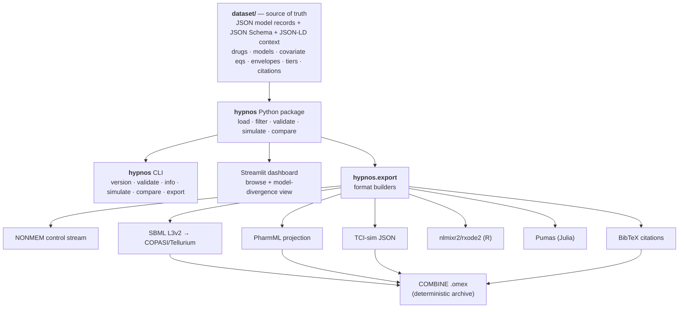
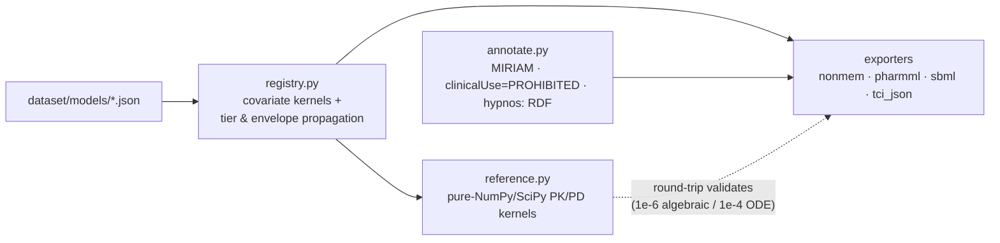
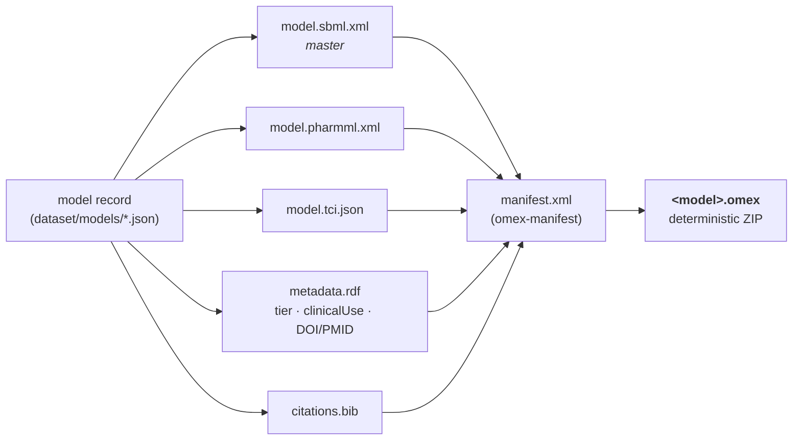

# Hypnos

**A curated, citation-backed dataset of anesthetic and perioperative PK/PD model parameters — annotated with explicit confidence tiers *and applicability envelopes*, with envelope-aware forward simulation and exports into the standard pharmacometric formats (PharmML, NONMEM, nlmixr2/rxode2, Pumas, SBML).**

[](https://github.com/clay-good/hypnos/actions/workflows/ci.yml)
&nbsp;Code: MIT · Dataset: CC-BY-4.0 · Python ≥ 3.9

> ### ⚠️ NOT FOR CLINICAL USE
> Hypnos is **not** a clinical decision-support tool, **not** a TCI pump driver, **not** a dosing calculator, and **not** validated for any decision affecting a real patient. It is for research, method development, education, and simulation only. Every export carries a machine-readable `clinicalUse = "PROHIBITED"` flag. There is **no inverse control** — Hypnos simulates forward (dose → predicted concentration/effect) and will never compute the infusion required to *reach* a target. See [spec §10](docs/specs/v0.1/spec.md).

> *Hypnos* (Greek god of sleep) is the root of *hypnotic*, the drug class at this dataset's core — a piece of mythology that is also a precise technical term in the field. Hypnos is the sibling of [Nidus](https://github.com/), reusing its architecture, tier philosophy, and "infrastructure, not a simulator; honest about uncertainty by default" stance.

---

## The problem: model-selection risk

Total intravenous anesthesia, target-controlled infusion (TCI), closed-loop control, depth-of-anesthesia modeling, and the machine-learning-on-VitalDB community all rest on a small set of **population PK/PD models**. For propofol alone a researcher routinely picks between Marsh, Schnider, Kataria/Paedfusor, and Eleveld. These models:

- live in PDFs from 1991–2018, often paywalled;
- publish parameters in inconsistent parameterizations (volumes/clearances vs. micro-rate constants);
- have **different, often unstated, applicability envelopes** and **documented failure modes** outside them (Schnider's lean-body-mass term misbehaves at high BMI; weight-only Marsh performs poorly in the elderly);
- are re-typed — and quietly mis-typed — into the next paper and the next simulator config.

The field has said so in print: *the availability of multiple PK/PD models for a single drug increases the risk of invalid model selection.* There is open raw data (VitalDB, Open TCI) and there are individual published models, but nothing curated, tiered, and machine-readable in between that says, honestly, **which numbers, for which patient, with what confidence, citing what evidence, and where they break.**

**Hypnos is that layer.**

## The headline feature: the model-divergence view

Pick a virtual patient and a dose schedule. Hypnos overlays the predicted plasma and effect-site curves from *every eligible model*, **greys out** the ones whose envelope the patient violates, and reports the **quantitative divergence** between them. This makes model-selection risk *visible and measurable*.


Both panels are real output from this repo's `compare()` API (the same one [the dashboard](dashboard/app.py) drives), now overlaying all three adult propofol models (Marsh, Schnider, Eleveld):

- **Left — elderly patient (72 y, 60 kg, F).** All three are in-envelope yet their predicted effect-site peaks span **5.6 µg/mL (169%)**: Schnider spikes to ~8 µg/mL while Marsh and Eleveld rise slowly to ~3.7, driven largely by their different `ke0` (Marsh 0.26, Eleveld ~0.15, Schnider 0.456 min⁻¹). Same drug, same dose — a clinically enormous disagreement a single-model simulator hides.
- **Right — obese patient (40 y, 140 kg, M).** Schnider is **greyed out and auto-tiered to D**: the patient's BMI (47) is outside its derivation envelope *and* triggers the documented James-LBM failure mode (the non-physical early spike). Eleveld — built for broad application including the obese — stays in-envelope at Tier A alongside Marsh. The envelope picks the right tool automatically.

```text
$ hypnos compare --drug propofol --age 40 --weight 140 --height 172 --sex M
included (2):
  - hypnotics_iv.propofol.eleveld_2018         tier A  Ce peak 3.974
  - hypnotics_iv.propofol.marsh_1991           tier B  Ce peak 3.741
excluded for envelope (2):
  - hypnotics_iv.propofol.paedfusor_2005       tier D  (pediatric model used in an adult ...)
  - hypnotics_iv.propofol.schnider_1998        tier D  (ENVELOPE: bmi=47.3 outside [20, 42]
        -> tiered down to D; FAILURE MODE [James LBM term inverts] -> tiered down to D)
```

The same view works for **remifentanil** (`--drug remifentanil`): Minto and Eleveld agree closely for a standard adult (a useful cross-check, ~5% effect-site spread), but Eleveld's broad fat-free-mass envelope stays valid for the obese and pediatric patients where Minto's adult/James-LBM envelope is correctly greyed out. Agreement where both are valid, honest exclusion where one is not: exactly what a model-selection instrument should show.

## Drug–drug interaction: the propofol–remifentanil synergy surface

The clinically dominant TIVA pairing is propofol + remifentanil, and their hypnotic interaction is **supra-additive** (synergistic): adding remifentanil markedly deepens hypnosis at the same propofol dose. Hypnos models this with a Greco-type response surface and a two-drug forward simulator (`simulate_interaction`), composing two independent PK models into one effect.


- **Left** — same propofol dose, ± remifentanil (real output). The opioid pushes BIS from a 27.8 nadir to 14.1.
- **Right** — the Greco surface `E = E0 − Emax·U^γ/(1+U^γ)` with `U = u_prop + u_remi + α·u_prop·u_remi`. The **curved** iso-BIS contours are the synergy: pure additivity (`α = 0`) would draw straight lines. At zero opioid the surface collapses exactly to the propofol-alone sigmoid, so it composes consistently with the PK kernels.

> **Honesty note (same stance as Eleveld).** The response-surface *mathematics* is exact and round-trip validated; the *coefficients* are representative/illustrative (**Tier C, unverified**) pending field-by-field transcription of the Bouillon 2004 surface. The qualitative result — remifentanil spares propofol / deepens hypnosis — is robust; the exact numbers are flagged, not asserted. `simulate_interaction` propagates the **worst** tier among PK-A, PK-B, and the surface (here C), and still tiers down to **D** if either patient covariate set is out of envelope.

```python
ir = hypnos.simulate_interaction(
    ds, "interactions.propofol_remifentanil.greco_bis",
    pk_a="hypnotics_iv.propofol.schnider_1998",
    pk_b="opioids.remifentanil.minto_1997",
    patient=dict(age=40, weight=70, height=170, sex="M"),
    schedule_a=[("bolus", 0, "2 mg/kg"), ("infusion", 0, "6 mg/kg/h")],
    schedule_b=[("bolus", 0, "1 mcg/kg"), ("infusion", 0, "0.25 mcg/kg/min")],
    t=np.linspace(0, 30, 181),
)
ir.effect_min, ir.tier        # 14.1, "C"
```

## Breadth & pediatrics: explicit Tier-D extrapolation labeling

Phase C widens coverage beyond the propofol/remifentanil core — a new drug class (the α₂-agonist **dexmedetomidine**, Hannivoort 2015) and the pediatric propofol model **Paedfusor** — and makes the spec's headline pediatric idea operational: when an adult model is used in a child (or a pediatric model in an adult), Hypnos does not merely flag "out of envelope," it **names the extrapolation and tiers it to D**.


For a 6-year-old, 20 kg child, only Paedfusor is in-envelope. Marsh and Schnider are greyed out and explicitly labeled *pediatric extrapolations* — and the figure shows why that matters: the adult models, if you ignored the label, would predict roughly half (Schnider) to 1.5× (Marsh) the plasma concentration of the validated pediatric model. The labeling is symmetric: Paedfusor used in an adult is flagged as a pediatric-model extrapolation, and a 90-year-old outside dexmedetomidine's 18–70 y range is labeled a *geriatric extrapolation*.

```text
$ hypnos compare --drug propofol --age 6 --weight 20 --height 115 --sex M
included (1):
  - hypnotics_iv.propofol.paedfusor_2005       tier B  ...
excluded for envelope (2):
  - hypnotics_iv.propofol.marsh_1991      tier D  (... PEDIATRIC EXTRAPOLATION: age 6 y is below the
        model's derivation range (>= 16 y); an adult model used in a child is not predictive -> Tier D)
  - hypnotics_iv.propofol.schnider_1998   tier D  (... PEDIATRIC EXTRAPOLATION ...)
```

## Inhalational agents: a different parameter convention (MAC)

Phase D brings in the non-IV families, which do **not** fit compartmental PK. Volatile anaesthetics are characterized by **MAC** (minimum alveolar concentration), its **age correction**, and **partition coefficients** — a distinct, first-class `physicochemical` model type with its own kernel. Hypnos ships sevoflurane, desflurane, isoflurane, and nitrous oxide, and evaluates age-corrected MAC, the MAC fraction (a depth surrogate), and the *additive* combined MAC fraction when nitrous oxide is co-administered.


The age correction is the verified, load-bearing relation (Nickalls & Mapleson 2003): `MAC(age) = MAC40 · 10^(−0.00269·(age−40))`, ~6% per decade and **universal** across agents — the right panel shows all three potent agents collapsing onto a single normalized curve. Envelope enforcement applies here too (the relation is valid for age > 1 y).

```text
$ hypnos mac --agent sevoflurane --age 75 --end-tidal 1.2 --n2o 50
MAC (age-corrected): 1.45 vol%   (MAC40 1.8)        # 75 y reduces MAC ~19% below the age-40 anchor
end-tidal 1.2 vol% -> MAC fraction 0.83
+ N2O 50 vol% -> combined MAC fraction 1.43          # MAC fractions are additive
```

```python
hypnos.mac(ds, "volatiles.sevoflurane.mac", age=75, end_tidal_pct=1.2, n2o_end_tidal_pct=50).combined_mac_fraction
```

**Neuromuscular blockers** are seeded: a **train-of-four (T1 twitch) sigmoid** PD record (the NMB convention — a steep Hill curve on a twitch-height scale, Ce50 ≈ 0.82 µg/mL at the adductor pollicis) composes onto a rocuronium PK model that is curated but **kernel-pending** (the Wierda 1991 compartmental parameters aren't openly reconcilable, so `simulate()` refuses it). Sugammadex reversal (1:1 encapsulation binding kinetics) is deferred — it needs its own model type, like the deferred local-anesthetics subsystem.

## Install & quickstart

```bash
git clone https://github.com/clay-good/hypnos
cd hypnos
pip install -e ".[dev]"          # add ",dashboard" for the Streamlit UI

hypnos version
hypnos validate                  # JSON-Schema + integrity checks on the dataset
hypnos info                      # counts by subsystem / tier / review status
hypnos compare --drug propofol --age 72 --weight 60 --height 162 --sex F
```

```python
import numpy as np
import hypnos

ds = hypnos.load()
m = ds["hypnotics_iv.propofol.schnider_1998"]
m.tier                                      # "B"
m.applicability_envelope.weight_kg          # Range(min=44, max=123)
m.review_status                             # "unverified"

# Forward simulation (NO inverse control, by design)
patient = dict(age=72, weight=60, height=162, sex="F")
schedule = [("bolus", 0.0, "2 mg/kg"), ("infusion", 0.0, "6 mg/kg/h")]
t = np.linspace(0, 60, 361)
res = hypnos.simulate(ds, m.id, patient=patient, schedule=schedule, t=t,
                      pd_model="pd_effect.propofol.bis_sigmoid")
res.cp, res.ce, res.effect      # plasma, effect-site conc, BIS trajectory
res.tier, res.warnings          # propagated tier + envelope/failure-mode warnings

# Model-divergence comparison — the headline feature
cmp = hypnos.compare(ds, drug="propofol", patient=patient, schedule=schedule, t=t)
cmp.divergence["ce"]            # {'max_abs': 5.62, 'max_rel': 1.36, ...}
cmp.excluded                    # models greyed out for envelope violation, with reasons
```

## How it works

The **dataset is the single source of truth.** Everything else — simulation, exports, the dashboard — is a deterministic projection of the JSON. No second store of numbers to drift.





### The model record — the unit of curation

One JSON file = one model of one drug for one purpose (e.g. *propofol PK — Schnider 1998*). Validated against [`dataset/schema/model.schema.json`](dataset/schema/model.schema.json). Two fields carry the anesthesia-specific load-bearing ideas:

- **`applicability_envelope`** — the covariate ranges the model was actually derived in. First-class, machine-readable, **enforced by the simulator**.
- **`known_failure_modes`** — documented, cited ways a model misbehaves, each with a machine-evaluable `predicate` (e.g. `"bmi > 42"`) and an `action` (`tier_down_to_D` / `warn` / `exclude`).

### Confidence tiers and how they propagate

| Tier | Meaning |
| --- | --- |
| **A** | Externally validated across ≥2 independent populations; broad covariate range; acceptable predictive performance (\|MDPE\| ≲ 10–20%, MDAPE ≲ 20–30%). |
| **B** | One robust population model with ≥1 external validation; performance reported and reasonable. |
| **C** | Single small/narrow derivation cohort; little/no external validation. |
| **D** | Used outside its derivation envelope, or an extrapolation, or a hypothesized link with no quantitative validation. **Not predictive.** |

Two rules, enforced in code and by `hypnos validate`:

1. **Worst input wins.** A record's tier equals the worst tier among its parameters. A composed simulation (PK + `ke0` + PD) inherits the worst tier among its components. *Example: Schnider PK (B) + BIS sigmoid (C) ⇒ the BIS trajectory is reported as Tier **C**.*
2. **Envelope violations force a Tier-D floor.** Any request outside the envelope, or that trips a failure-mode predicate, is auto-tiered to **D** with an attached warning. You cannot launder an extrapolation into an A. Age extrapolations are **named**: a sub-range patient in an adult model is a *pediatric extrapolation*, an over-range patient in a pediatric model is flagged as such, and a ≥65 y patient above an adult model's range is a *geriatric extrapolation*.

### Reference kernels & validation

Every model with `kernel.implemented = true` binds to a **pure-NumPy/SciPy reference kernel** ([`reference.py`](python/hypnos/reference.py)):

- an n-compartment mammillary linear-ODE PK solver, integrated **exactly** via the augmented matrix exponential (machine precision, robust even when `ke0 = 0`);
- the effect-compartment first-order `ke0` link;
- the sigmoid E_max / Hill PD transform (propofol→BIS, rocuronium→train-of-four);
- the two-drug Greco response surface;
- the volatile MAC age-correction (Mapleson/Nickalls) — a non-compartmental, physicochemical kernel.

Validation, run in CI ([test suite](python/tests)):

- **Analytic vs. independent numeric** — the matrix-exponential solver is checked against a separate `scipy.solve_ivp` integration (≤ 1e-4 relative) and against the closed-form one-compartment bolus solution (≤ 1e-7).
- **Export round-trip** — each SBML / TCI-JSON / rxode2 / Pumas export is parsed back, re-simulated, and compared to the kernel (≤ 1e-6 algebraic). An export bug cannot ship silently.
- **NONMEM `$THETA` fidelity** — emitted thetas are asserted equal to the instantiated parameters.
- **`.omex` determinism** — the COMBINE archive is byte-identical across runs (fixed timestamps); CI rebuilds it and validates the manifest, so an archive bug cannot ship silently.

### Export formats

Exports are generated artifacts, never hand-edited (CI regenerates them), each instantiated at a stated reference patient and carrying the propagated tier, the verbatim covariate equations, MIRIAM `bqmodel:isDerivedFrom` DOI/PMID links, and the universal `clinicalUse = PROHIBITED` flag.

| Format | Role | Status |
| --- | --- | --- |
| **NONMEM** control stream (`$PK`/`$THETA`/…) | Lingua franca of population PK | ✅ ADVAN11/TRANS4 |
| **SBML** L3v2 | Compartmental ODE → COPASI/Tellurium; continuity with Nidus | ✅ rate-rule form, round-tripped |
| **TCI-sim JSON** | Clean ingestable JSON for the open-TCI/simulator community | ✅ round-tripped |
| **PharmML** (projection) | The "SBML of PK/PD"; durable interop anchor | ✅ structural + params + provenance |
| **nlmixr2 / rxode2** (R) | Open-source pharmacometric estimation & simulation | ✅ round-tripped |
| **Pumas** (Julia) | Modern open pharmacometric simulation | ✅ round-tripped |
| **COMBINE `.omex`** | Provenance-bundled archive (SBML+PharmML+TCI-JSON+RDF+BibTeX) | ✅ deterministic, manifest-validated |
| **BibTeX** | Citation export (cite Hypnos *and* the source) | ✅ per-model + dataset |

```nonmem
; HYPNOS EXPORT — NOT FOR CLINICAL USE
;   clinicalUse = PROHIBITED — research/education/simulation only
;   model: hypnotics_iv.propofol.schnider_1998  (tier B, review: unverified)
; Population covariate equations (verbatim from source):
;   Cl1: Cl1 = 1.89 + 0.0456*(WGT-77) - 0.0681*(LBM-59) + 0.0264*(HGT-177)
$SUBROUTINES ADVAN11 TRANS4
$THETA
  1.78948   ; 1 CL  (L/min)
  4.27      ; 2 V1  (L)
  ...
; bqmodel:isDerivedFrom = https://doi.org/10.1097/00000542-199805000-00006
```

### The COMBINE `.omex` archive — the distribution unit

One `.omex` (a ZIP with a COMBINE `omex-manifest`) bundles a model's SBML (master) + PharmML + TCI-JSON + a provenance `metadata.rdf` + a `citations.bib`, so the model travels with its interop projections, its confidence tier, its DOI/PMID provenance, and the `clinicalUse` flag in one self-describing file.



Archives are written with **fixed entry timestamps**, so a given dataset version always yields **byte-identical** bytes — a reproducibility guarantee CI enforces.

```bash
hypnos export --format omex   --output exports/hypnos.omex   # one archive, all PK models
hypnos export --format omex   --output exports/omex/          # one .omex per model
hypnos export --format bibtex --output exports/               # citations.bib
python scripts/regenerate.py                                  # regenerate every export + figures
```

## Current coverage (v0.1.0 — A/B complete · C/D/E core)

Honest status. A is the propofol spine; B adds the dominant opioid and the interaction surface; C widens to a new drug class and pediatrics; D brings in the non-IV families; E hardens for release (COMBINE `.omex`, BibTeX, reproducibility, verified MDPE/MDAPE) ([roadmap](docs/specs/v0.1/spec.md#11-phased-roadmap)). **16 models · 9 drugs · 7 subsystems · 14 executable kernels · 8 export formats.**

| Model | Record | Kernel | Tier | Notes |
| --- | --- | --- | --- | --- |
| Propofol PK — **Marsh 1991** | ✅ | ✅ executable | B | Weight-only; warns in elderly. |
| Propofol PK — **Schnider 1998** | ✅ | ✅ executable | B | Age/weight/height/James-LBM; high-BMI failure mode encoded. |
| Propofol PK — **Eleveld 2018** | ✅ | ✅ executable | A | General-purpose, broad envelope (neonate→obese elderly). Kernel transcribed from the published equations (cross-checked vs the `tci` R package), validated to reproduce the reference individual exactly; `review_status` stays **`unverified`** pending human PDF confirmation. |
| Propofol PK — **Paedfusor 2005** | ✅ | ✅ executable | B | Pediatric (1–12 y); the Tier-D extrapolation showcase, in both directions. |
| Propofol PD — **BIS sigmoid** | ✅ | ✅ executable | C | Effect-site → BIS; composes onto any PK model and floors the tier to C. |
| Remifentanil PK — **Minto 1997** | ✅ | ✅ executable | B | Age + James-LBM; shares the high-BMI LBM failure mode; concentrations in µg/mL (= ng/mL ÷ 1000). |
| Remifentanil PK — **Eleveld 2017** | ✅ | ✅ executable | A | Allometric (FFM) general-purpose; broad envelope (neonate→obese elderly), faster `ke0` than Minto. Validated to reference; `unverified`. Found+fixed a V3 reference typo in the `tci` source. |
| Dexmedetomidine PK — **Hannivoort 2015** | ✅ | ✅ executable | B | New drug class (α₂-agonist); allometric (vol ^1, CL ^0.75); adult-only, narrow BMI. |
| Fentanyl PK — **Shafer 1990** | ✅ | ⏳ pending | C | Curated record with verified citation; kernel deferred — secondary sources disagree on the exact micro-rate constants, so `simulate()` refuses it. |
| Interaction — **propofol×remifentanil** (Greco/BIS) | ✅ | ✅ executable | C | Two-drug response surface; math exact and round-tripped, **coefficients illustrative/unverified** pending Bouillon-2004 transcription. |
| Volatiles — **sevoflurane · desflurane · isoflurane · N₂O** (MAC) | ✅ | ✅ executable | B | New `physicochemical` type: MAC40 + Mapleson age-correction + partition coefficients; MAC fraction + nitrous-oxide additivity. |
| Rocuronium PK — **Wierda 1991** | ✅ | ⏳ pending | C | Seeds `nmb_agents`; kernel deferred (compartmental params not openly reconcilable). |
| Rocuronium PD — **train-of-four sigmoid** | ✅ | ✅ executable | C | NMB convention: steep Hill on twitch-height; Ce50 ≈ 0.82 µg/mL (adductor pollicis). Composes onto a rocuronium PK kernel once verified. |

> **Implemented but still `unverified` — the distinction that matters.** Eleveld's covariate equations (post-menstrual-age maturation, allometric scaling, BMI/age sigmoids) are exactly where transcription errors hide (spec §9). The kernel was transcribed from the published equations, cross-checked against the open `tci` R implementation, and validated to reproduce the reference individual (V1=6.28, CL=1.79, ke0=0.146) to the decimal. It still reads `unverified`, because **reproducing one reference point is not a human confirming every covariate equation against the PDF.** Promoting it to `verified` is the next highest-leverage contribution — run `hypnos verify hypnotics_iv.propofol.eleveld_2018` for the checklist. Models whose parameters cannot even be reconciled to a primary source (rocuronium PK, Shafer fentanyl) stay kernel-pending and `simulate()` refuses them.

## Verification: the single highest-leverage contribution

Every model ships `unverified` and the dataset says so out loud. Promotion to `verified` requires a human to open the source PDF and confirm, field by field, every structural parameter **and** every covariate equation (the covariate equations are where published-vs-implemented divergence hides). **LLMs may assist but never promote** — nothing automated writes `review_status = verified`.

Hypnos ships tooling to *support* that work without doing it for you:

```text
$ hypnos status
verification coverage: 0/15 verified (0%)   unverified 15   contested 0

start here (highest-leverage unverified models — implemented kernel + best tier first):
  - alpha2_agonists.dexmedetomidine.hannivoort_2015  tier B  kernel   cite hannivoort-2015-dexmedetomidine
  - hypnotics_iv.propofol.marsh_1991                 tier B  kernel   cite marsh-1991-propofol-pk
  - hypnotics_iv.propofol.schnider_1998              tier B  kernel   cite schnider-1998-propofol-pk
  ...

$ hypnos verify hypnotics_iv.propofol.schnider_1998 --markdown   # copy-pasteable PR checklist
```

`hypnos verify <id>` emits the field-by-field checklist — each parameter, each covariate equation (e.g. the James LBM term), the envelope, the derivation population, and the DOI to confirm — as plain text or markdown for a PR. The prioritization is deliberate: models with an implemented kernel and the best tier come first, because verifying those unlocks trustworthy simulation. See the essay [*Why model-selection risk is the load-bearing idea*](docs/about/essay.md) for the philosophy, and [CONTRIBUTING.md](CONTRIBUTING.md) for the checklist rules.

## Design decisions

| Decision | Rationale |
| --- | --- |
| **Pure Python** (NumPy/SciPy); R/Julia only as export targets | Nothing is compute-bound; the R/Julia models are generated artifacts, not a runtime dependency. |
| **Dataset is the centerpiece; everything else is a projection** | The durable contribution is the curated, tiered, envelope-annotated models — not any one viewer or solver. |
| **Envelope + failure modes are first-class and machine-enforced** | Model-selection risk is the core pain; making the envelope enforceable is the load-bearing idea. |
| **Tier & envelope warnings propagate; worst input wins** | A composed simulation is only as trustworthy as its weakest component or furthest extrapolation. |
| **Humans verify; LLMs do not promote** | `unverified → verified` requires reading the source PDF and confirming the parameters *and the covariate equations*. Even Eleveld — implemented and validated to its reference patient — stays `unverified`; that flag means *a human has checked the PDF*, nothing less. Models whose parameters cannot be reconciled to a primary source (rocuronium PK, Shafer fentanyl) stay kernel-pending and `simulate()` refuses them. |
| **Age extrapolations are named, not just flagged** | "Out of envelope" is generic; "pediatric extrapolation of an adult model" is the actual clinical risk the spec calls out. The label is first-class and tested. |
| **No TCI engine, no dosing output, ever** | The line between "research simulator" and "unregulated medical device" is exactly the inverse-control step. Hypnos stays on the safe side by construction. |
| **Exact matrix-exponential solver** | Closed-form per segment for a linear time-invariant system; faster and more accurate than stepwise integration, and the augmented form handles `ke0 = 0` without a singular inverse. |

## Repository layout

```
hypnos/
├── README.md · LICENSE (MIT, code) · LICENSE-DATASET (CC-BY-4.0, data)
├── CITATION.cff · CONTRIBUTING.md · pyproject.toml
├── dataset/                     # the single source of truth
│   ├── schema/                  # JSON Schema + JSON-LD context
│   ├── drugs/ · models/ · citations/
│   └── VERSION
├── python/hypnos/
│   ├── load.py · filter.py · validate.py · models.py
│   ├── reference.py             # pure-NumPy/SciPy PK/PD kernels
│   ├── simulate.py              # forward simulation + compare + interaction (no inverse control)
│   ├── inhalational.py          # volatile MAC API (age correction, fraction, N2O additivity)
│   ├── verification.py          # verification checklists + coverage (guides humans; never promotes)
│   ├── cli.py
│   └── export/                  # registry · annotate · nonmem · pharmml · sbml · tci_json · rxode2 · pumas · bibtex · combine(.omex)
├── scripts/regenerate.py        # deterministically regenerate all exports + figures
├── notebooks/                   # reference notebooks executed in CI (nbmake)
├── CHANGELOG.md · .zenodo.json   # release metadata (Zenodo DOI on first tagged release)
├── python/tests/                # analytic-vs-numeric, round-trip, envelope, tier, CLI, verification
├── dashboard/app.py             # Streamlit: browse + model-divergence view
├── docs/about/essay.md          # why model-selection risk is the load-bearing idea
├── docs/specs/v0.1/spec.md      # the design spec
└── .github/workflows/ci.yml
```

## Cheat sheet

```bash
hypnos version
hypnos validate                                   # schema + integrity (citations, tiers, kernels, envelopes)
hypnos info                                       # counts by subsystem / tier / review status
hypnos status                                     # verification coverage + what to verify next
hypnos verify <model_id> [--markdown]             # field-by-field verification checklist
hypnos simulate <model_id> --age .. --weight .. --height .. --sex .. [--pd <pd_id>]
hypnos compare  --drug propofol --age .. --weight .. --height .. --sex ..
hypnos interact --age .. --weight .. --height .. --sex ..             # propofol+remifentanil synergy
hypnos mac --agent sevoflurane --age 75 [--end-tidal 1.2] [--n2o 50]  # age-corrected MAC + fraction
hypnos export   --format {nonmem,pharmml,sbml,tci_json,rxode2,pumas,bibtex,omex} --output exports/ [--model <id>]
python scripts/regenerate.py                                          # regenerate all exports + figures
streamlit run dashboard/app.py
```

```python
ds = hypnos.load()
hypnos.select(ds, drug="propofol", purpose="pk", kernel_only=True)   # filter
hypnos.summary(ds)                                                    # dataset stats
hypnos.simulate(ds, model_id, patient=..., schedule=..., t=...)       # forward sim
hypnos.compare(ds, drug=..., patient=..., schedule=..., t=...)        # divergence view
hypnos.simulate_interaction(ds, surface_id, pk_a=.., pk_b=.., ...)    # two-drug response surface
hypnos.mac(ds, agent_id, age=.., end_tidal_pct=.., n2o_end_tidal_pct=..)  # volatile MAC + fraction
hypnos.verification_summary(ds)                                       # coverage + next-to-verify
hypnos.model_verification(ds, model_id)                              # field-by-field checklist object
hypnos.validate_dataset(ds)                                           # -> list of problems ([] == valid)
```

## Licensing & citation

- **Code:** MIT ([`LICENSE`](LICENSE)).
- **Dataset:** CC-BY-4.0 ([`LICENSE-DATASET`](LICENSE-DATASET)) — each model record is data; attribution required.
- **Citation:** [`CITATION.cff`](CITATION.cff); Zenodo concept DOI on first release. Every model also exposes its primary-source DOI via `model.primary_citation` — when you use one model, cite Hypnos **and** the original source.

## Roadmap

| Phase | Content | Status |
| --- | --- | --- |
| **A — Propofol spine** | Marsh/Schnider/Eleveld PK + `ke0` + propofol→BIS; reference kernels; NONMEM/PharmML/SBML/TCI-JSON; round-trip validation; divergence view | ✅ complete (Marsh + Schnider + Eleveld all executable; 3-way divergence view live) |
| **B — Opioids + interaction** | remifentanil (Minto, Eleveld); propofol–remifentanil response surface; nlmixr2/rxode2 + Pumas export | ✅ complete (Minto + Eleveld both executable; propofol×remifentanil Greco surface; R + Julia export round-tripped) |
| **C — Breadth** | dexmedetomidine, ketamine, midazolam, fentanyl family; pediatric models with explicit Tier-D labeling | ✅ core shipped (dexmedetomidine + Paedfusor executable with explicit pediatric/geriatric extrapolation labeling; fentanyl curated, kernel pending; ketamine/midazolam roadmap) |
| **D — Inhalational + NMB** | volatile MAC/partition/uptake; neuromuscular blockers + train-of-four; sugammadex reversal | ✅ core shipped (4 volatiles with MAC age-correction + additivity executable; rocuronium seeded with TOF PD; rocuronium PK kernel + sugammadex binding kinetics pending) |
| **E — Hardening** | external-validation MDPE/MDAPE backfill; COMBINE `.omex`; Zenodo DOI | ✅ core shipped (deterministic `.omex` + BibTeX exporters; `scripts/regenerate.py`; `.zenodo.json` + `CHANGELOG.md`; Eleveld MDPE/MDAPE backfilled; broader MDPE/MDAPE backfill + minted DOI on first tagged release) |

---

*Hypnos is the honest, reusable ground-truth layer beneath anesthetic simulation, built on one principle: a simulation is only as trustworthy as its weakest, least-validated input — so make that fact a first-class, machine-readable field.*
