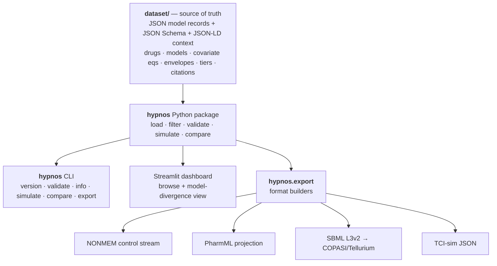
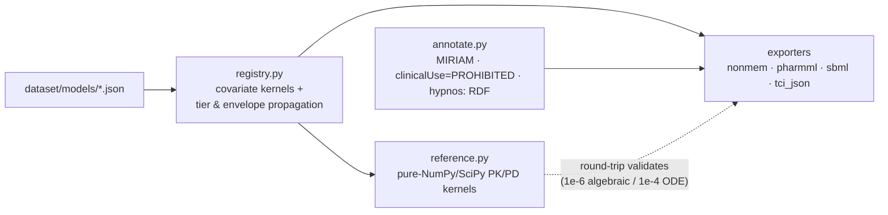

# Hypnos

**A curated, citation-backed dataset of anesthetic and perioperative PK/PD model parameters — annotated with explicit confidence tiers *and applicability envelopes*, with envelope-aware forward simulation and exports into the standard pharmacometric formats (PharmML, NONMEM, nlmixr2/rxode2, Pumas, SBML).**

[](https://github.com/clay-good/hypnos/actions/workflows/ci.yml)
&nbsp;Code: MIT · Dataset: CC-BY-4.0 · Python ≥ 3.9

> ### ⚠️ NOT FOR CLINICAL USE
> Hypnos is **not** a clinical decision-support tool, **not** a TCI pump driver, **not** a dosing calculator, and **not** validated for any decision affecting a real patient. It is for research, method development, education, and simulation only. Every export carries a machine-readable `clinicalUse = "PROHIBITED"` flag. There is **no inverse control** — Hypnos simulates forward (dose → predicted concentration/effect) and will never compute the infusion required to *reach* a target. See [spec §10](docs/specs/v0.1/spec.md).

> *Hypnos* (Greek god of sleep) is the root of *hypnotic*, the drug class at this dataset's core — a piece of mythology that is also a precise technical term in the field. Hypnos is the sibling of [Nidus](https://github.com/), reusing its architecture, tier philosophy, and "infrastructure, not a simulator; honest about uncertainty by default" stance.

---

## The problem: model-selection risk

Total intravenous anesthesia, target-controlled infusion (TCI), closed-loop control, depth-of-anesthesia modeling, and the machine-learning-on-VitalDB community all rest on a small set of **population PK/PD models**. For propofol alone a researcher routinely picks between Marsh, Schnider, Kataria/Paedfusor, and Eleveld. These models:

- live in PDFs from 1991–2018, often paywalled;
- publish parameters in inconsistent parameterizations (volumes/clearances vs. micro-rate constants);
- have **different, often unstated, applicability envelopes** and **documented failure modes** outside them (Schnider's lean-body-mass term misbehaves at high BMI; weight-only Marsh performs poorly in the elderly);
- are re-typed — and quietly mis-typed — into the next paper and the next simulator config.

The field has said so in print: *the availability of multiple PK/PD models for a single drug increases the risk of invalid model selection.* There is open raw data (VitalDB, Open TCI) and there are individual published models, but nothing curated, tiered, and machine-readable in between that says, honestly, **which numbers, for which patient, with what confidence, citing what evidence, and where they break.**

**Hypnos is that layer.**

## The headline feature: the model-divergence view

Pick a virtual patient and a dose schedule. Hypnos overlays the predicted plasma and effect-site curves from *every eligible model*, **greys out** the ones whose envelope the patient violates, and reports the **quantitative divergence** between them. This makes model-selection risk *visible and measurable*.


The figure is generated by `python -c` in [the dashboard](dashboard/app.py); both panels are real output from this repo:

- **Left — elderly patient (72 y, 60 kg, F).** Marsh and Schnider are both in-envelope (Tier B) yet their predicted effect-site peaks differ by **5.6 µg/mL (136%)**, driven largely by their different `ke0` (Marsh 0.26 vs Schnider 0.456 min⁻¹). Same drug, same dose — a clinically enormous disagreement that a single-model simulator hides.
- **Right — obese patient (40 y, 140 kg, M).** Schnider is **greyed out and auto-tiered to D**: the patient's BMI (47) is outside the derivation envelope *and* triggers the documented James-LBM failure mode, which inflates clearance and produces the non-physical early spike (~12.5 µg/mL). You cannot accidentally get an A-looking number from that extrapolation.

```text
$ hypnos compare --drug propofol --age 40 --weight 140 --height 172 --sex M
included (1):
  - hypnotics_iv.propofol.marsh_1991           tier B  Ce peak 3.741
excluded for envelope (1):
  - hypnotics_iv.propofol.schnider_1998        tier D  (ENVELOPE: bmi=47.3 outside [20, 42]
        -> tiered down to D; FAILURE MODE [James LBM term inverts] -> tiered down to D)
unavailable (1):
  - hypnotics_iv.propofol.eleveld_2018         (reference kernel pending verified transcription)
```

## Install & quickstart

```bash
git clone https://github.com/clay-good/hypnos
cd hypnos
pip install -e ".[dev]"          # add ",dashboard" for the Streamlit UI

hypnos version
hypnos validate                  # JSON-Schema + integrity checks on the dataset
hypnos info                      # counts by subsystem / tier / review status
hypnos compare --drug propofol --age 72 --weight 60 --height 162 --sex F
```

```python
import numpy as np
import hypnos

ds = hypnos.load()
m = ds["hypnotics_iv.propofol.schnider_1998"]
m.tier                                      # "B"
m.applicability_envelope.weight_kg          # Range(min=44, max=123)
m.review_status                             # "unverified"

# Forward simulation (NO inverse control, by design)
patient = dict(age=72, weight=60, height=162, sex="F")
schedule = [("bolus", 0.0, "2 mg/kg"), ("infusion", 0.0, "6 mg/kg/h")]
t = np.linspace(0, 60, 361)
res = hypnos.simulate(ds, m.id, patient=patient, schedule=schedule, t=t,
                      pd_model="pd_effect.propofol.bis_sigmoid")
res.cp, res.ce, res.effect      # plasma, effect-site conc, BIS trajectory
res.tier, res.warnings          # propagated tier + envelope/failure-mode warnings

# Model-divergence comparison — the headline feature
cmp = hypnos.compare(ds, drug="propofol", patient=patient, schedule=schedule, t=t)
cmp.divergence["ce"]            # {'max_abs': 5.62, 'max_rel': 1.36, ...}
cmp.excluded                    # models greyed out for envelope violation, with reasons
```

## How it works

The **dataset is the single source of truth.** Everything else — simulation, exports, the dashboard — is a deterministic projection of the JSON. No second store of numbers to drift.





### The model record — the unit of curation

One JSON file = one model of one drug for one purpose (e.g. *propofol PK — Schnider 1998*). Validated against [`dataset/schema/model.schema.json`](dataset/schema/model.schema.json). Two fields carry the anesthesia-specific load-bearing ideas:

- **`applicability_envelope`** — the covariate ranges the model was actually derived in. First-class, machine-readable, **enforced by the simulator**.
- **`known_failure_modes`** — documented, cited ways a model misbehaves, each with a machine-evaluable `predicate` (e.g. `"bmi > 42"`) and an `action` (`tier_down_to_D` / `warn` / `exclude`).

### Confidence tiers and how they propagate

| Tier | Meaning |
| --- | --- |
| **A** | Externally validated across ≥2 independent populations; broad covariate range; acceptable predictive performance (\|MDPE\| ≲ 10–20%, MDAPE ≲ 20–30%). |
| **B** | One robust population model with ≥1 external validation; performance reported and reasonable. |
| **C** | Single small/narrow derivation cohort; little/no external validation. |
| **D** | Used outside its derivation envelope, or an extrapolation, or a hypothesized link with no quantitative validation. **Not predictive.** |

Two rules, enforced in code and by `hypnos validate`:

1. **Worst input wins.** A record's tier equals the worst tier among its parameters. A composed simulation (PK + `ke0` + PD) inherits the worst tier among its components. *Example: Schnider PK (B) + BIS sigmoid (C) ⇒ the BIS trajectory is reported as Tier **C**.*
2. **Envelope violations force a Tier-D floor.** Any request outside the envelope, or that trips a failure-mode predicate, is auto-tiered to **D** with an attached warning. You cannot launder an extrapolation into an A.

### Reference kernels & validation

Every model with `kernel.implemented = true` binds to a **pure-NumPy/SciPy reference kernel** ([`reference.py`](python/hypnos/reference.py)):

- an n-compartment mammillary linear-ODE PK solver, integrated **exactly** via the augmented matrix exponential (machine precision, robust even when `ke0 = 0`);
- the effect-compartment first-order `ke0` link;
- the sigmoid E_max / Hill PD transform.

Validation, run in CI ([test suite](python/tests)):

- **Analytic vs. independent numeric** — the matrix-exponential solver is checked against a separate `scipy.solve_ivp` integration (≤ 1e-4 relative) and against the closed-form one-compartment bolus solution (≤ 1e-7).
- **Export round-trip** — each SBML / TCI-JSON export is parsed back, re-simulated, and compared to the kernel (≤ 1e-6 algebraic). An export bug cannot ship silently.
- **NONMEM `$THETA` fidelity** — emitted thetas are asserted equal to the instantiated parameters.

### Export formats

Exports are generated artifacts, never hand-edited (CI regenerates them), each instantiated at a stated reference patient and carrying the propagated tier, the verbatim covariate equations, MIRIAM `bqmodel:isDerivedFrom` DOI/PMID links, and the universal `clinicalUse = PROHIBITED` flag.

| Format | Role | Status |
| --- | --- | --- |
| **NONMEM** control stream (`$PK`/`$THETA`/…) | Lingua franca of population PK | ✅ ADVAN11/TRANS4 |
| **SBML** L3v2 | Compartmental ODE → COPASI/Tellurium; continuity with Nidus | ✅ rate-rule form, round-tripped |
| **TCI-sim JSON** | Clean ingestable JSON for the open-TCI/simulator community | ✅ round-tripped |
| **PharmML** (projection) | The "SBML of PK/PD"; durable interop anchor | ✅ structural + params + provenance |
| nlmixr2/rxode2 · Pumas · COMBINE `.omex` | R / Julia / archive targets | 🔜 Phase B/E |

```nonmem
; HYPNOS EXPORT — NOT FOR CLINICAL USE
;   clinicalUse = PROHIBITED — research/education/simulation only
;   model: hypnotics_iv.propofol.schnider_1998  (tier B, review: unverified)
; Population covariate equations (verbatim from source):
;   Cl1: Cl1 = 1.89 + 0.0456*(WGT-77) - 0.0681*(LBM-59) + 0.0264*(HGT-177)
$SUBROUTINES ADVAN11 TRANS4
$THETA
  1.78948   ; 1 CL  (L/min)
  4.27      ; 2 V1  (L)
  ...
; bqmodel:isDerivedFrom = https://doi.org/10.1097/00000542-199805000-00006
```

## Current coverage (v0.1.0 — Phase A core)

Honest status. Phase A of the [roadmap](docs/specs/v0.1/spec.md#11-phased-roadmap) is the propofol spine.

| Model | Record | Kernel | Tier | Notes |
| --- | --- | --- | --- | --- |
| Propofol PK — **Marsh 1991** | ✅ | ✅ executable | B | Weight-only; warns in elderly. |
| Propofol PK — **Schnider 1998** | ✅ | ✅ executable | B | Age/weight/height/James-LBM; high-BMI failure mode encoded. |
| Propofol PK — **Eleveld 2018** | ✅ | ⏳ pending | A | Curated record; kernel **deliberately deferred** until the intricate maturation/allometry covariate structure is human-verified — `simulate()` refuses it rather than risk a mis-transcribed equation. This is the honesty stance made operational. |
| Propofol PD — **BIS sigmoid** | ✅ | ✅ executable | C | Effect-site → BIS; composes onto any PK model and floors the tier to C. |

> **Why Eleveld's kernel is pending, not faked.** The project's whole reason for existing is to *not* be another source of quietly mis-typed numbers. Eleveld's covariate equations (post-menstrual-age maturation, allometric scaling, BMI/age sigmoids) are exactly where transcription errors hide (spec §9). Shipping them unverified would contradict the dataset's purpose. Two correct, round-trip-validated models that genuinely disagree already make the divergence view real. Promoting Eleveld to an executable kernel is the highest-leverage next contribution — see [CONTRIBUTING.md](CONTRIBUTING.md).

## Design decisions

| Decision | Rationale |
| --- | --- |
| **Pure Python** (NumPy/SciPy); R/Julia only as export targets | Nothing is compute-bound; the R/Julia models are generated artifacts, not a runtime dependency. |
| **Dataset is the centerpiece; everything else is a projection** | The durable contribution is the curated, tiered, envelope-annotated models — not any one viewer or solver. |
| **Envelope + failure modes are first-class and machine-enforced** | Model-selection risk is the core pain; making the envelope enforceable is the load-bearing idea. |
| **Tier & envelope warnings propagate; worst input wins** | A composed simulation is only as trustworthy as its weakest component or furthest extrapolation. |
| **Humans verify; LLMs do not promote** | `unverified → verified` requires reading the source PDF and confirming the parameters *and the covariate equations*. |
| **No TCI engine, no dosing output, ever** | The line between "research simulator" and "unregulated medical device" is exactly the inverse-control step. Hypnos stays on the safe side by construction. |
| **Exact matrix-exponential solver** | Closed-form per segment for a linear time-invariant system; faster and more accurate than stepwise integration, and the augmented form handles `ke0 = 0` without a singular inverse. |

## Repository layout

```
hypnos/
├── README.md · LICENSE (MIT, code) · LICENSE-DATASET (CC-BY-4.0, data)
├── CITATION.cff · CONTRIBUTING.md · pyproject.toml
├── dataset/                     # the single source of truth
│   ├── schema/                  # JSON Schema + JSON-LD context
│   ├── drugs/ · models/ · citations/
│   └── VERSION
├── python/hypnos/
│   ├── load.py · filter.py · validate.py · models.py
│   ├── reference.py             # pure-NumPy/SciPy PK/PD kernels
│   ├── simulate.py              # forward simulation + compare (no inverse control)
│   ├── cli.py
│   └── export/                  # registry · annotate · nonmem · pharmml · sbml · tci_json
├── python/tests/                # analytic-vs-numeric, round-trip, envelope, tier, CLI
├── dashboard/app.py             # Streamlit: browse + model-divergence view
├── docs/specs/v0.1/spec.md      # the design spec
└── .github/workflows/ci.yml
```

## Cheat sheet

```bash
hypnos version
hypnos validate                                   # schema + integrity (citations, tiers, kernels, envelopes)
hypnos info                                       # counts by subsystem / tier / review status
hypnos simulate <model_id> --age .. --weight .. --height .. --sex .. [--pd <pd_id>]
hypnos compare  --drug propofol --age .. --weight .. --height .. --sex ..
hypnos export   --format {nonmem,pharmml,sbml,tci_json} --output exports/ [--model <id>]
streamlit run dashboard/app.py
```

```python
ds = hypnos.load()
hypnos.select(ds, drug="propofol", purpose="pk", kernel_only=True)   # filter
hypnos.summary(ds)                                                    # dataset stats
hypnos.simulate(ds, model_id, patient=..., schedule=..., t=...)       # forward sim
hypnos.compare(ds, drug=..., patient=..., schedule=..., t=...)        # divergence view
hypnos.validate_dataset(ds)                                           # -> list of problems ([] == valid)
```

## Licensing & citation

- **Code:** MIT ([`LICENSE`](LICENSE)).
- **Dataset:** CC-BY-4.0 ([`LICENSE-DATASET`](LICENSE-DATASET)) — each model record is data; attribution required.
- **Citation:** [`CITATION.cff`](CITATION.cff); Zenodo concept DOI on first release. Every model also exposes its primary-source DOI via `model.primary_citation` — when you use one model, cite Hypnos **and** the original source.

## Roadmap

| Phase | Content | Status |
| --- | --- | --- |
| **A — Propofol spine** | Marsh/Schnider/Eleveld PK + `ke0` + propofol→BIS; reference kernels; NONMEM/PharmML/SBML/TCI-JSON; round-trip validation; divergence view | ✅ core shipped (Marsh + Schnider executable; Eleveld curated, kernel pending) |
| **B — Opioids + interaction** | remifentanil (Minto, Eleveld); propofol–remifentanil response surface; nlmixr2/rxode2 + Pumas export | 🔜 |
| **C — Breadth** | dexmedetomidine, ketamine, midazolam, fentanyl family; pediatric models with explicit Tier-D labeling | 🔜 |
| **D — Inhalational + NMB** | volatile MAC/partition/uptake; neuromuscular blockers + train-of-four; sugammadex reversal | 🔜 |
| **E — Hardening** | external-validation MDPE/MDAPE backfill; COMBINE `.omex`; Zenodo DOI | 🔜 |

---

*Hypnos is the honest, reusable ground-truth layer beneath anesthetic simulation, built on one principle: a simulation is only as trustworthy as its weakest, least-validated input — so make that fact a first-class, machine-readable field.*
