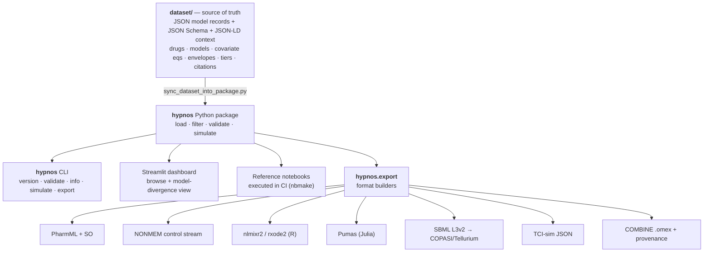
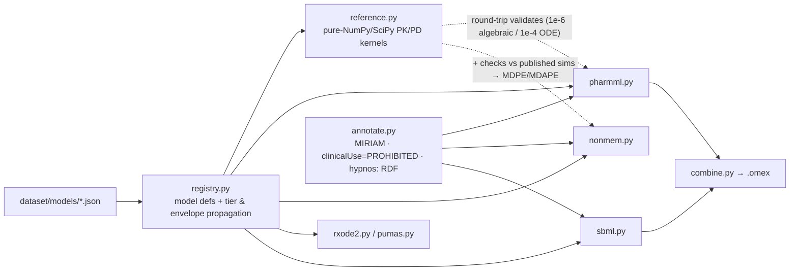

# Hypnos — design spec (v0.1)

**A curated, citation-backed dataset of anesthetic and perioperative pharmacokinetic–pharmacodynamic (PK/PD) model parameters — annotated with explicit confidence tiers *and applicability envelopes*, and exportable into the standard pharmacometric and simulation formats (PharmML, NONMEM, nlmixr2/rxode2, Pumas, SBML).**

> *Hypnos* (Greek: the god of sleep) — and the root of *hypnotic*, the pharmacological class of the drugs at this dataset's core. The name is the same kind of pun Nidus is: a piece of mythology that also happens to be a precise technical term in the field.

This spec is written as the sibling of [Nidus](https://github.com/) and deliberately reuses its architecture, its tier philosophy, and its "infrastructure, not a simulator; honest about uncertainty by default" stance. If you've read the Nidus README, most of the shapes here will be familiar. Where Hypnos differs from Nidus, it's because pharmacometrics has its own native interop formats, its own accuracy metrics, and a much sharper safety boundary — these get first-class treatment below.

---

## 1. The problem this dataset solves

Total intravenous anesthesia, target-controlled infusion (TCI), closed-loop control research, depth-of-anesthesia modeling, and the entire machine-learning-on-VitalDB community all rest on the same small set of **population PK/PD models**: the compartmental models that say *given this patient and this infusion history, here is the predicted plasma and effect-site concentration over time, and here is the predicted effect (BIS, MAC fraction, train-of-four).*

There are several competing models for almost every drug. For propofol alone, a researcher routinely chooses between Marsh, Schnider, Kataria/Paedfusor (pediatric), and the newer general-purpose Eleveld model. These models:

- live in PDFs from 1991–2018, often behind paywalls;
- publish their parameters in inconsistent parameterizations (volumes-and-clearances vs. micro rate constants, fixed vs. covariate-scaled);
- have **different, often unstated, applicability envelopes** (the covariate ranges they were derived in), and **documented failure modes outside them** (e.g., the Schnider model's lean-body-mass term misbehaves at high BMI; weight-only models like Marsh perform poorly in the elderly);
- are re-typed — and quietly mis-typed — into the next paper's methods section and the next TCI simulator's config.

The field has acknowledged this in print: *the availability of multiple PK/PD models for a single drug increases the risk of invalid model selection by the user.* And the field already has the two adjacent layers — **open raw data** (VitalDB on PhysioNet; the Open TCI propofol database) and **individual published models** — but it has no curated, tiered, machine-readable resource sitting between them that says, honestly, *which numbers, for which patient, with what confidence, citing what evidence, and where they break.*

**Hypnos is that resource.** Curated once, citation-backed, tier-annotated, envelope-aware, machine-readable, and exported into the formats the pharmacometrics and TCI communities already run. It is the smallest piece of infrastructure that could make anesthetic simulation **honest about model-selection uncertainty by default.**

### Why this is the right project for a solo open-source builder

It complements rather than competes with the crowded autonomous-AI-scientist space. It requires **no wet lab and no clinical deployment** — it is a curation-and-simulation infrastructure layer, exactly like Nidus. And it plays directly to a demonstrated strength: turning scattered, paywalled, uncertainty-laden literature into a tier-annotated, machine-readable, format-exporting dataset.

---

## 2. Scope — the declared envelope

Hypnos covers **published population PK/PD models for anesthetic and directly perioperative drugs in humans**, together with each model's covariate structure, derivation population, applicability envelope, documented failure modes, predictive-performance metrics where published, and confidence tier.

**In scope**

- Compartmental population PK models (volumes/clearances or micro-rate-constant parameterizations) with their covariate equations.
- Effect-site link models (the plasma→effect-site equilibration rate constant, conventionally written *k*₍e0₎).
- PD effect models (sigmoid E_max / Hill models for BIS, MAC fraction, train-of-four, sedation scales).
- Drug–drug interaction / response-surface models (the propofol–remifentanil hypnotic synergy surfaces are the canonical case).
- Inhalational-agent parameters (MAC and its age correction, MAC-awake, blood:gas and oil:gas partition coefficients, uptake/distribution constants).
- Reversal/antagonist kinetics (sugammadex encapsulation stoichiometry/kinetics; naloxone; flumazenil).

**Out of scope (declared, like Nidus's exclusions)**

- Any per-patient dosing recommendation, bedside calculator, or pump-driver logic. *(See §10. This is a hard line, not a roadmap item.)*
- Disease-state and organ-failure PK alterations beyond what a model's own covariates encode (hepatic/renal failure scaling is a future tier-D research envelope, not v0.x scope).
- Veterinary models, novel/experimental agents without a peer-reviewed population model, and proprietary device algorithms.
- Local-anesthetic systemic toxicity thresholds are a **deferred** subsystem (valuable, but the safety framing needs its own pass before shipping).

Like Nidus, the scope has a declared ceiling. Growth means adding enumerated models within the envelope; anything outside it is an explicit, documented exclusion rather than a silent gap.

---

## 3. Subsystems

The Nidus "13 subsystems" map here onto **drug-class model families**. Each family is a namespace; each model within it (Marsh, Schnider, …) is a record.

| Subsystem | What it covers | Canonical models (illustrative, not exhaustive) |
| --- | --- | --- |
| `hypnotics_iv` | IV hypnotic PK/PD | propofol (Marsh, Schnider, Eleveld, Kataria/Paedfusor), etomidate, midazolam |
| `dissociatives` | Dissociative/NMDA hypnotics | ketamine (esketamine where modeled separately) |
| `alpha2_agonists` | Sedative α₂-agonists | dexmedetomidine (Dyck, Hannivoort, Pérez-Guillé), clonidine |
| `opioids` | Opioid analgesic PK/PD | remifentanil (Minto, Eleveld, Kim), fentanyl (Shafer/Scott), sufentanil (Gepts), alfentanil (Maitre), morphine |
| `volatiles` | Inhalational agents | sevoflurane, desflurane, isoflurane, nitrous oxide (MAC, partition coefficients, uptake) |
| `nmb_agents` | Neuromuscular blockers | rocuronium, vecuronium, cisatracurium, atracurium, succinylcholine |
| `effect_link` | Plasma→effect-site link models | per-drug *k*₍e0₎, time-to-peak-effect parameterizations |
| `pd_effect` | Effect (E_max/Hill) models | propofol→BIS, volatile→MAC-fraction, NMB→train-of-four |
| `interactions` | Multi-drug response surfaces | propofol–remifentanil hypnotic synergy (Minto 2000, Bouillon 2004), opioid–hypnotic |
| `reversal` | Antagonists & encapsulators | sugammadex, naloxone, flumazenil, neostigmine |
| `local_anesthetics` ⚠️ | Systemic LA PK + toxicity envelope (**deferred**) | lidocaine, bupivacaine, ropivacaine |

Each subsystem entry in the dataset records, at minimum: the drug, the parameterization convention used, the unit system, and the set of model records belonging to it.

---

## 4. The model record — the unit of curation

A Hypnos record is **one model of one drug for one effect/PK purpose** (e.g., "propofol PK — Schnider 1998"). It is richer than a Nidus parameter row because a PK/PD model is a *structured object*, not a scalar. The schema (JSON, validated against a JSON Schema, with a JSON-LD context for the provenance predicates) carries:

```jsonc
{
  "id": "hypnotics_iv.propofol.schnider_1998",
  "drug": { "name": "propofol", "unii": "...", "atc": "N01AX10" },
  "purpose": "pk",                      // pk | pd | link | interaction | physicochemical
  "structure": {
    "compartments": 3,
    "parameterization": "volumes_clearances", // or micro_rate_constants
    "elimination": "linear",
    "effect_compartment": true
  },
  "parameters": [
    {
      "symbol": "V1", "label": "central volume",
      "value": { "central": 4.27, "low": null, "high": null, "units": "L" },
      "covariate_model": "V1 = 4.27",      // verbatim published equation, machine-parseable
      "tier": "B",
      "extraction": {
        "review_status": "unverified",
        "tier_rationale": "Single derivation cohort (n=24, healthy adults); widely used but...",
        "source_locator": "Table 2, p. 1505"
      },
      "primary_citation": "schnider-1998-propofol-pk"
    }
    // ... V2, V3, Cl1, Cl2, Cl3, and the covariate terms (age, weight, height, LBM, sex)
  ],
  "covariates": {
    "required": ["age", "weight", "height", "sex"],
    "lbm_equation": "james_1976"           // named, because the choice has known failure modes
  },
  "applicability_envelope": {
    "age_years": { "min": 25, "max": 81 },
    "weight_kg": { "min": 44, "max": 123 },
    "bmi_kg_m2": { "min": 20, "max": 42 },
    "populations": ["healthy_adult", "elective_surgery"],
    "derivation_n": 24
  },
  "known_failure_modes": [
    {
      "condition": "bmi_kg_m2 > 42 (approx, via James LBM)",
      "behavior": "James lean-body-mass term inverts; central compartment scaling becomes non-physical",
      "action": "tier_down_to_D and emit warning on simulate/export",
      "citation": "absalom-2009-schnider-obese"
    }
  ],
  "predictive_performance": [
    { "metric": "MDPE", "value": -7.0, "units": "%", "population": "...", "citation": "..." },
    { "metric": "MDAPE", "value": 18.0, "units": "%", "population": "...", "citation": "..." }
  ],
  "tier": "B",                              // record-level tier = worst contributing tier
  "primary_citation": "schnider-1998-propofol-pk"
}
```

Two fields deserve emphasis because they are the anesthesia-specific load-bearing ideas, the analog of Nidus's per-parameter confidence tier:

- **`applicability_envelope`** — the covariate ranges the model was actually derived in. First-class, machine-readable, and enforced by the simulator (§6).
- **`known_failure_modes`** — documented, cited ways a model misbehaves *outside* (or sometimes inside) its envelope. Encoding these is the honest counterpart to "Tier D where a channel is hypothesized but unquantified." Here it's "Tier D where the model is being asked to do something its authors never validated."

---

## 5. Confidence tiers (adapted for PK/PD)

Same A/B/C/D spine as Nidus, re-specified for population models. The crucial adaptation: pharmacometrics has **standard, quantitative predictive-performance metrics** (Varvel's median performance error / median absolute performance error — MDPE = bias, MDAPE = inaccuracy — plus wobble and divergence), so tier assignment can be partly *numeric* rather than purely editorial.

| Tier | Meaning |
| --- | --- |
| **A** | Externally validated across ≥2 independent populations with acceptable prospective predictive performance (clinically usual thresholds: |MDPE| ≲ 10–20%, MDAPE ≲ 20–30%); commonly recommended in guidelines; broad covariate range. |
| **B** | One robust population model (large n, broad covariates) with at least one external-validation study; performance reported and reasonable. |
| **C** | Single small/narrow derivation cohort; little or no external validation; parameterization or covariate model speculative. |
| **D** | Used outside its derivation envelope, or pediatric/special-population extrapolation of an adult model, or a hypothesized link with no quantitative validation. **Not predictive.** |

**Tier propagation — "the worst input tier wins," same as Nidus.** A full simulation typically composes a *PK model* + a *k*₍e0₎ *link* + a *PD effect model* (+ optionally an *interaction surface*). The composed simulation inherits the **worst** tier among its components. A Tier-A propofol PK model driven through a Tier-C *k*₍e0₎ yields a Tier-C effect-site prediction, and Hypnos labels it as such — in the dashboard, in the API, and in the `nidus:`-style RDF annotation embedded in every export.

**Envelope violations force a tier floor.** If a simulation request lands outside a model's `applicability_envelope`, or triggers a `known_failure_mode`, the result is **automatically tiered down to D** and a warning is attached. You cannot accidentally get an A-looking number from an out-of-envelope extrapolation.

---

## 6. Reference kernels & the simulator boundary

Like Nidus's pure-NumPy reference kernels, every Hypnos model binds to a **pure-NumPy/SciPy reference kernel** so exports can be round-trip validated against it. The kernels implement exactly what's needed and nothing more:

- An n-compartment mammillary linear ODE PK solver (analytic where closed-form, `scipy.integrate` otherwise).
- The effect-compartment first-order link (the *k*₍e0₎ model).
- The sigmoid E_max / Hill PD transform.
- Response-surface interaction evaluation.
- Inhalational uptake (the partition-coefficient / alveolar-uptake relations).

**Hypnos is NOT a TCI engine and NOT a pump algorithm.** It simulates concentration and effect *trajectories* for research, comparison, and export validation. It does not compute infusion rates to *achieve* a target, because that is the step that turns a dataset into a dosing device. (See §10.) The dashboard's killer feature is built entirely on forward simulation:

> **Model-divergence view.** Pick a virtual patient (age/weight/height/sex) and a dosing schedule; Hypnos overlays the predicted plasma and effect-site curves from *every* eligible model for that drug (Marsh vs. Schnider vs. Eleveld …), greys out the ones whose envelope the virtual patient violates, and reports the quantitative divergence between them. This makes "model-selection risk" — the exact problem the literature names — *visible and measurable.* It is the Hypnos analog of Nidus's tier-distribution figure: the dataset being honest about itself.

Validation tolerances mirror Nidus (algebraic ≈ 1e-6; ODE ≈ 1e-4 relative). Where a source paper publishes example simulations or observed-vs-predicted data, the kernel is additionally checked against those, and the resulting MDPE/MDAPE recorded in `predictive_performance`.

---

## 7. Export formats — the pharmacometric interop layer

This is where Hypnos diverges most from Nidus, because pharmacometrics has its *own* native standards. The mapping is direct: where Nidus targets SBML/CellML/PhysioCell/COMBINE, Hypnos targets the formats this field actually runs.

| Format | Role | Analog in Nidus |
| --- | --- | --- |
| **PharmML** (+ **SO**, Standard Output) | The standardized pharmacometric markup language — the "SBML of PK/PD." The durable interop anchor. | SBML |
| **NONMEM** control stream (`$PK`/`$PRED`/`$THETA`/`$OMEGA`/`$SIGMA`) | The lingua franca of population PK; what most pharmacometricians read first. | — |
| **nlmixr2 / rxode2** model (R) | Open-source pharmacometric estimation & simulation. | CellML (open ecosystem target) |
| **Pumas** (Julia) | Modern open pharmacometric simulation. | — |
| **SBML** (L3v2) | PK models *are* compartmental ODE systems, so SBML export keeps continuity with the systems-biology toolchain (COPASI, Tellurium) and with Nidus. | SBML |
| **TCI-sim JSON** | A clean, documented JSON the open-TCI / simulator community can ingest (parameters + covariate equations + envelope + the **NOT FOR CLINICAL USE** flag). | PhysioCell `<user_parameters>` |
| **CSV / BibTeX** | Flat parameter export and citation export, as in Nidus. | CSV/BibTeX |
| **COMBINE-style `.omex`** | Bundles PharmML + SO + SBML + provenance into one archive. | COMBINE `.omex` |

**Exports are generated artifacts, never hand-edited** (CI regenerates on every push), and each carries:

- a `hypnos:datasetVersion` provenance annotation so consumers can pin for reproducibility;
- the propagated **confidence tier** and any **envelope/failure-mode warnings** as MIRIAM-style RDF (`bqbiol:isDescribedBy` DOI/PMID links survive even if a downstream tool strips the custom `hypnos:` predicates — same durability argument as Nidus);
- a mandatory, machine-readable **`hypnos:clinicalUse = "PROHIBITED — research/education/simulation only"`** annotation on *every* exported model. There is no Phase-C-only carve-out as in Nidus; the warning is universal because the drugs are lethal if mis-dosed.

---

## 8. Architecture

The **dataset is the single source of truth.** Everything else is a deterministic projection of the JSON, exactly as in Nidus — no second store of numbers to drift.





**Design decisions and why (Nidus's table, ported):**

| Decision | Rationale |
| --- | --- |
| **Pure Python** (NumPy/SciPy), R/Julia only as *export targets* | Nothing is compute-bound. The R/Julia models are generated artifacts, not a runtime dependency. |
| **Dataset is the centerpiece; everything else is a presentation layer** | The durable contribution is the curated, tiered, envelope-annotated models — not any one viewer or solver. |
| **Applicability envelope + known failure modes are first-class** | Anesthesia's model-selection risk is the core pain. Making the envelope machine-enforced is the load-bearing idea, the way confidence tiers are for Nidus. |
| **Tier & envelope warnings propagate; worst input wins** | A composed simulation is only as trustworthy as its weakest component or its furthest extrapolation. |
| **Humans verify; LLMs do not promote** | `unverified → verified` requires a human reading the source PDF and confirming both the parameters *and the covariate equations* (the latter is where transcription errors hide). |
| **No TCI engine, no dosing output, ever** | The line between "research simulator" and "unregulated medical device" is exactly the inverse-control step. Hypnos stays on the safe side by construction. |

---

## 9. Validation & verification workflow

**Round-trip validation** (automated, CI): every exported PharmML/NONMEM/SBML model is re-simulated and checked against the pure-Python reference kernel within tolerance. An export bug cannot ship silently — same guarantee as Nidus.

**Literature validation** (where the source supports it): if a paper publishes example concentration-time simulations or observed-vs-predicted data, the kernel output is compared and the MDPE/MDAPE recorded. This is what lets tier assignment be partly numeric.

**Human verification** (the gate on `verified`): a contributor opens the source PDF and confirms, field by field, (1) every structural parameter, (2) every covariate equation *and the exact form of any LBM/FFM term*, (3) the derivation population and n, and (4) the stated applicability range. Only then does `review_status` move from `unverified` to `verified`. LLMs assist (drafting, cross-checking) but never promote on their own authority. The verified count is reported honestly, not aspirationally.

**The single highest-leverage contribution**, exactly as in Nidus: promoting `unverified` models to `verified` by reading the source PDF — with the anesthesia-specific twist that the covariate equations are the part most worth double-checking, because that's where the published-vs-implemented divergence lives.

---

## 10. Safety & scope guardrails (non-negotiable)

Anesthetic drugs are lethal at the wrong dose. Hypnos is therefore **more** conservative than Nidus, in specific, enforced ways:

- **NOT a clinical decision-support tool. NOT a TCI pump driver. NOT a dosing calculator. NOT validated for any decision affecting a real patient.** For research, method development, education, and simulation only.
- **No inverse-control / target-achieving output.** Hypnos simulates *forward* (dose history → predicted concentration/effect). It will not compute the infusion rate required to *reach* a target concentration or BIS, because that is the function of a regulated device.
- **Every export carries a machine-readable `clinicalUse = "PROHIBITED"` annotation**, plus a human-readable banner. This is universal, not reserved for low-tier models.
- **The package surfaces no "recommended dose."** The README, dashboard, and CLI all repeat the boundary. The dashboard's model-divergence view is explicitly framed as *"how much do published models disagree?"* — a research question — never *"what should I give this patient?"*
- **Local-anesthetic systemic-toxicity thresholds are deferred** until the safety framing for that subsystem is designed separately.
- Like Nidus: not exhaustive, not a simulator's replacement, not an automated researcher.

If you ever feel tempted to add a "just enter the patient and get a dose" feature, that is the signal that the project has crossed the line it was designed to stay behind.

---

## 11. Phased roadmap

| Phase | Content | Done = |
| --- | --- | --- |
| **A — Propofol spine** | propofol PK (Marsh, Schnider, Eleveld) + *k*₍e0₎ links + propofol→BIS PD; reference kernels; PharmML + NONMEM + SBML export; round-trip validation; model-divergence dashboard view. | The hardest, most-cited drug works end to end and the divergence view is live. |
| **B — Opioids + interaction** | remifentanil (Minto, Eleveld) PK/PD; propofol–remifentanil response surface; nlmixr2/rxode2 + Pumas export. | The clinically dominant pairing simulates, including synergy. |
| **C — Breadth** | dexmedetomidine, ketamine, midazolam, fentanyl family; pediatric models (Kataria/Paedfusor) with **explicit Tier-D extrapolation labeling**. | Coverage across the IV anesthetic formulary. |
| **D — Inhalational + NMB** | volatile-agent MAC/partition/uptake; neuromuscular blockers + train-of-four PD; sugammadex reversal kinetics. | The non-IV families are in, each with its own parameter conventions. |
| **E — Hardening** | external-validation MDPE/MDAPE backfill; COMBINE `.omex`; Zenodo DOI; CITATION.cff. | Citable, reproducible, releasable. |

Phase A alone is a genuinely useful, self-contained release — the propofol model-divergence view is the thing nobody has shipped openly and the thing the field most often re-implements by hand.

---

## 12. Repository layout

```
hypnos/
├── README.md
├── LICENSE                      # MIT (code)
├── LICENSE-DATASET              # CC-BY-4.0 (data)
├── CITATION.cff
├── CONTRIBUTING.md              # tier system, envelope rules, PDF-verification checklist
├── dataset/
│   ├── schema/                  # JSON Schema + JSON-LD context
│   ├── drugs/                   # drug-level metadata (UNII, ATC)
│   ├── models/                  # one JSON per model record (the source of truth)
│   └── citations/               # Crossref/PubMed-verified citation records
├── python/
│   └── hypnos/
│       ├── load.py · filter.py · validate.py
│       ├── simulate.py          # forward simulation API (no inverse control)
│       └── export/
│           ├── registry.py · reference.py
│           ├── pharmml.py · nonmem.py · rxode2.py · pumas.py · sbml.py
│           ├── tci_json.py · combine.py · annotate.py
├── dashboard/                   # Streamlit: browse + model-divergence view
├── notebooks/                   # executed in CI (nbmake), incl. divergence figure
└── docs/
    ├── about/essay.md           # the "why model-selection risk is the load-bearing idea" essay
    └── specs/v0.1/              # this document and its siblings
```

---

## 13. Cheat sheet (target API)

```python
import hypnos
ds = hypnos.load()

m = ds["hypnotics_iv.propofol.schnider_1998"]
m.tier                                   # "B"
m.applicability_envelope.weight_kg       # {min: 44, max: 123}
m.extraction.review_status               # "verified" | "unverified" | "contested"
m.primary_citation.doi

# Forward simulation (NO inverse control by design)
import numpy as np
from hypnos.simulate import simulate
patient = dict(age=72, weight=60, height=162, sex="F")
schedule = [("bolus", 0.0, "2 mg/kg"), ("infusion", 0.0, "6 mg/kg/h")]
traj = simulate(ds, "hypnotics_iv.propofol.schnider_1998",
                patient=patient, schedule=schedule, t=np.linspace(0, 60, 600))
traj.cp, traj.ce          # plasma & effect-site concentration
traj.tier, traj.warnings  # propagated tier + any envelope/failure-mode warnings

# Model-divergence comparison — the headline feature
cmp = hypnos.compare(ds, drug="propofol", purpose="effect_site",
                     patient=patient, schedule=schedule)
cmp.divergence            # quantitative disagreement between eligible models
cmp.excluded              # models greyed out for envelope violation, with reasons
```

```bash
hypnos version
hypnos validate                                  # JSON-Schema-validate the dataset
hypnos info                                       # counts by subsystem / tier / review status
hypnos export --format pharmml   --output exports/pharmml/
hypnos export --format nonmem    --output exports/nonmem/
hypnos export --format rxode2    --output exports/rxode2/
hypnos export --format sbml      --output exports/sbml/
hypnos export --format omex      --output exports/hypnos.omex
streamlit run dashboard/app.py
```

---

## 14. Licensing & citation

- **Code:** MIT.
- **Dataset:** CC-BY-4.0 — each model record is data; attribution required, no other restriction.
- **Citation:** Zenodo concept DOI on first release; `CITATION.cff` for machine-readable metadata. Every model also exposes its own primary-source DOI via `model.primary_citation.doi` — when you use one model, cite Hypnos **and** the original source.

---

## 15. One-paragraph pitch (for the README top / Zenodo abstract)

> Hypnos is a curated, citation-backed, machine-readable dataset of the population pharmacokinetic–pharmacodynamic models that anesthetic simulation, TCI research, and depth-of-anesthesia modeling depend on. Every model carries an explicit confidence tier, its derivation population, its applicability envelope, its documented failure modes, and its published predictive-performance metrics — and exports cleanly into PharmML, NONMEM, nlmixr2/rxode2, Pumas, and SBML. It is not a dosing tool and not a pump driver; it is the honest, reusable ground-truth layer beneath them, designed to make model-selection uncertainty visible by default. It is the sibling of Nidus, built on the same principle: a simulation is only as trustworthy as its weakest, least-validated input — so make that fact a first-class, machine-readable field.
